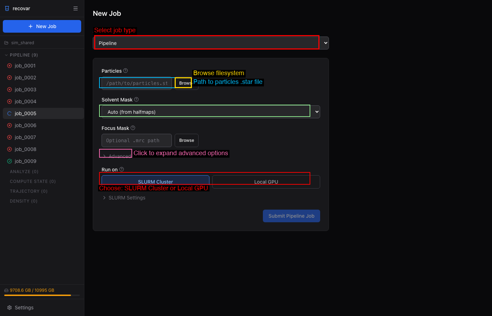

# Quick Start

## What you'll need

Before starting, make sure you have:

| Requirement | Details |
|---|---|
| **Particle stack** | A `.star` file (RELION) or `.cs` file (cryoSPARC) with CTF parameters |
| **Mask** | A `.mrc` binary mask covering your molecule of interest |
| **GPU** | An NVIDIA GPU (Volta or newer). 16+ GB VRAM is recommended; less works for smaller boxes or with `--downsample` / `--lazy` (40+ GB helps for large datasets at 256px) |
| **RECOVAR installed** | `pip install "recovar[gpu]"` for pipeline use; add `pip install "recovar[gui]"` for GUI support. See [Installation](installation.md) for details |

!!! tip "Timing"
    A small dataset (~50k particles at 128px) takes about 10 minutes end-to-end. Larger datasets (500k+ particles at 256px) may take 30--60 minutes.

---

## Run your first job

??? info "Key terms"
    - **zdim**: Number of latent-space dimensions. A first run with `zdim=4` is a good default (it's what the GUI uses); increase to 10 or 20 to resolve finer heterogeneity at the cost of speed.
    - **K-means**: Groups particles into representative conformational states.
    - **UMAP**: 2D visualization of the latent space for exploring heterogeneity.
    - **Eigenvalues**: Measure how much variance each principal component captures. Sharp drop = clear signal.
    - **Trajectory**: A series of volumes showing a conformational path between two states.

=== ":material-monitor: GUI"

    The easiest way to get started is through the web GUI.

    **1. Launch the GUI**

    ```bash
    recovar gui
    ```

    This opens a browser window at `http://localhost:8080`.

    **2. Create a project and submit a pipeline job**

    

    1. Click **Create Project** and choose a directory
    2. Click **New Job** > **Pipeline**
    3. Browse to your particles file (`.star` or `.cs`)
    4. Select a mask (or use Auto/Sphere)
    5. Click **Submit Pipeline Job**

    **3. Analyze results**

    Once the pipeline completes, click **Analyze this pipeline output** in **Next Steps**. The zdim defaults to 4 (good for a first look — raise it to 10 or 20 for finer detail), then click **Submit Analyze Job**.

    **4. Explore**

    The GUI shows eigenvalue spectra, UMAP scatter plots, and lets you click to generate volumes at any point in latent space. See the [GUI Guide](../guide/gui.md) for details.

=== ":octicons-terminal-16: CLI"

    **1. Interactive wizard (recommended for first-time users)**

    ```bash
    recovar quickstart
    ```

    The wizard walks you through selecting input files, mask, downsampling, and other options, then runs the pipeline. Works over SSH.

    **2. Or run directly**

    ```bash
    recovar init_project my_project
    cd my_project

    # RELION
    recovar pipeline particles.star --mask mask.mrc --project .

    # cryoSPARC
    recovar pipeline particles.cs --mask mask.mrc --datadir /path/to/cryosparc/project --project .

    # Analyze
    recovar analyze --zdim=10 --project .
    ```

    **3. View volumes**

    Open `.mrc` files in ChimeraX or any MRC viewer:

    ```
    Analyze/job_0001/kmeans/center000.mrc
    Analyze/job_0001/kmeans/center001.mrc
    ```

    If you prefer explicit output directories (no project system):

    ```bash
    recovar pipeline particles.star -o output --mask mask.mrc
    recovar analyze output --zdim=10
    ```

??? note "Expected output after each step"

    **After `recovar init_project`:** Creates the project directory with a `project.json` index file.

    **After `recovar pipeline`:** Creates `Pipeline/job_0001/` containing:

    - `output/volumes/mean.mrc`, `mean_half1_unfil.mrc`, `mean_half2_unfil.mrc` -- mean reconstruction and half-maps
    - `output/volumes/eigen_pos0000.mrc`, ... and `variance*.mrc` -- eigenvolumes and variance maps
    - `output/plots/` -- diagnostic plots (eigenvalue spectrum, etc.)
    - `model/` -- internal results: `params.pkl`, `embeddings.pkl`, and per-zdim coordinates under `model/zdim_<N>/`
    - `job.json`, `command.txt`, `run.log` -- run metadata

    **After `recovar analyze`:** Creates `Analyze/job_0001/` (or `analysis_<zdim>/` when run with `-o`) containing:

    - `kmeans/center000.mrc`, `center001.mrc`, ... -- cluster center volumes
    - `data/kmeans_result.pkl` -- k-means labels and centers
    - `plots/PCA/`, `plots/umap/` -- PC scatter and UMAP plots

---

## With downsampling

If your images are larger than ~256 pixels, downsample for faster processing:

```bash
recovar pipeline particles.star --mask mask.mrc --downsample 128 --project .
```

This pre-downsamples images into the shared project cache on the first run and reuses that cache across matching project runs.

---

## Project system

The project system is the standard RECOVAR workflow. Numbered job directories stay stable on disk (e.g. `Pipeline/job_0001/`, `Analyze/job_0001/`), while the CLI and GUI show human-readable job names from project metadata.

```bash
recovar init_project my_project
cd my_project
recovar pipeline particles.star --mask mask.mrc --project .
recovar analyze --zdim=10 --project .
recovar project_status
```

All commands accept `--project <dir>` to enable project mode. If you run from within a project directory, it is auto-detected.

---

## Next steps

Now that you have results, here's where to go next:

- **[Web GUI](../guide/gui.md)** -- launch the browser interface to interactively explore latent spaces and view 3D volumes
- **[Analyzing Results](../guide/analysis.md)** -- deep dive into k-means, trajectories, UMAP, and volume generation options
- **[Input Data](../guide/input-data.md)** -- supported formats and data preparation
- **[Downsampling](../guide/downsampling.md)** -- when and how to downsample for optimal results
