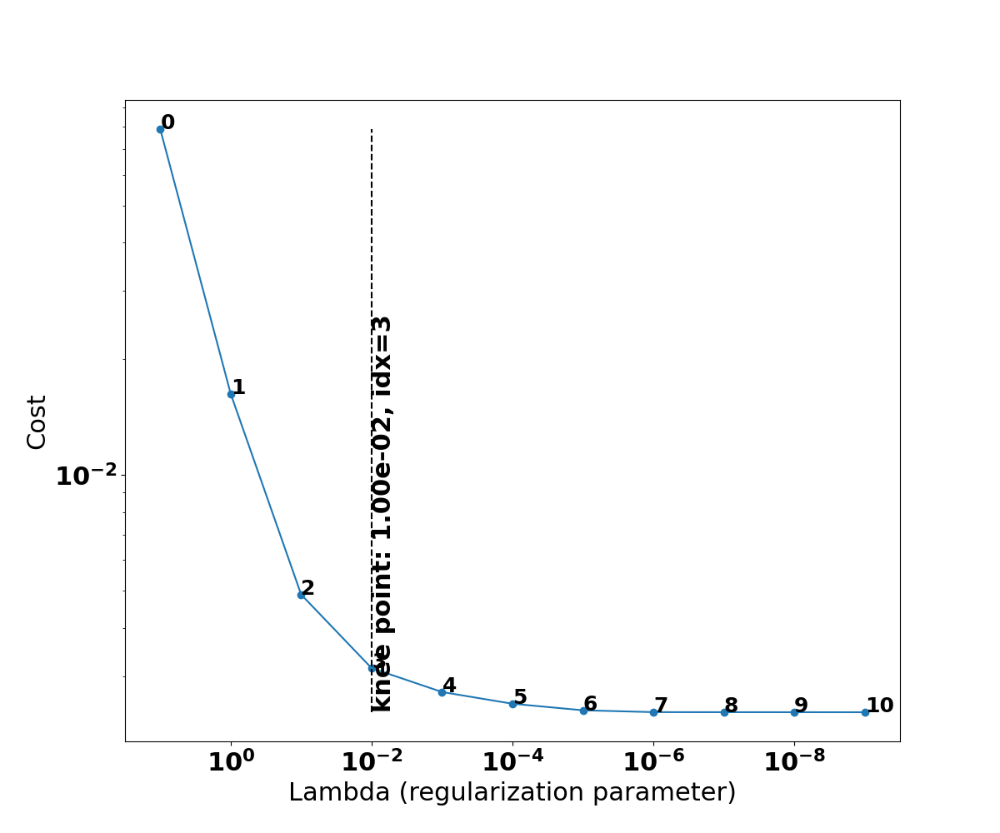
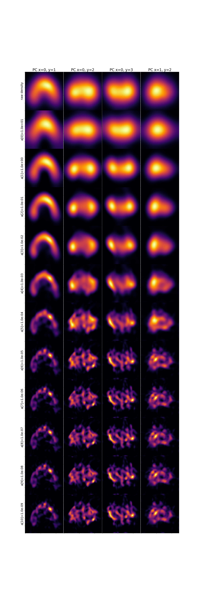

# Conformational Density

RECOVAR can estimate the probability density of conformations in the latent space. This enables:

- Identification of stable conformational states
- High-density trajectory computation

## Estimating density

```bash
recovar estimate_conformational_density output --pca_dim=4 --z_dim_used=4
```

This deconvolves the particle distribution in latent space to produce density estimates at multiple regularization levels. The output includes a recommended "knee" regularization (`deconv_density_knee.pkl`) that balances noise suppression with resolution.

| Flag | Default | Description |
|------|---------|-------------|
| `--pca_dim` | 4 | PCA dimensions for density estimation |
| `--z_dim_used` | Auto | Latent dimension to use |
| `--percentile_reject` | 10 | Reject % of data with large covariance |

!!! note
    Runtime scales exponentially with `--pca_dim`. Keep it at 4 or below.

### Example output

The estimator sweeps a range of deconvolution strengths and picks a "knee" on the L-curve of cost versus regularization — the point that balances noise suppression against over-fitting. Everything to the right of the knee mostly fits noise:



The deconvolved density at every regularization level is also saved as a grid, projected onto pairs of principal components. Heavily regularized estimates (top rows) are smooth and unimodal; lightly regularized ones (bottom rows) are sharper but noisier. The knee picks an intermediate level that reveals the distinct high-density basins — the stable conformational states — without over-fitting:



## Estimating stable states

```bash
recovar estimate_stable_states density_output/data/deconv_density_knee.pkl \
    -o stable_states
```

Identifies local maxima of the conformational density. The first argument is the density `.pkl` file produced by `estimate_conformational_density`.

## Using density for trajectories

The density can guide trajectory computation to follow high-density paths:

```bash
recovar compute_trajectory output -o trajectory --zdim=10 \
    --density density_output/data/deconv_density_knee.pkl \
    --endpts centers.txt --ind 0,1
```

Without `--density`, trajectories follow straight lines in latent space. With density, they curve to follow high-density regions.

!!! tip "GUI alternative"
    In the GUI's latent space explorer, you can select two points on the scatter plot to compute a trajectory interactively. See the [GUI Guide](gui.md#latent-space-explorer).

## Using the GUI

In the web GUI (`recovar gui`), click **New Job** and select **Density** from the Job Type dropdown. Pick a completed pipeline job in the output picker, set the **PCA Dimension**, and (optionally) set **Z Dimension Used** under the **Advanced** section. Click **Estimate Density** to submit.

You can also reach density estimation from a completed pipeline job's **Next Steps**, which pre-fills the pipeline output for you.

After density estimation completes, use the **Latent Space Explorer** to color particles by conformational density and visually identify stable states.
