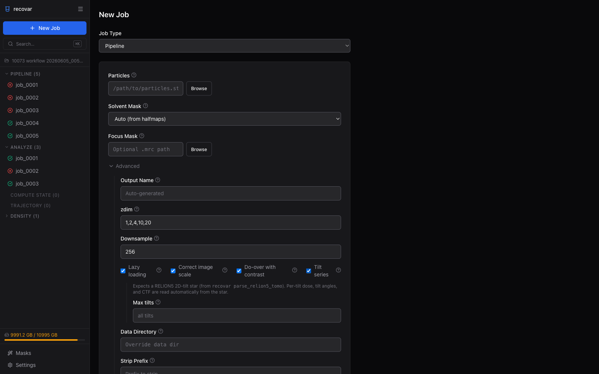

# Cryo-ET / Tomography

RECOVAR supports tilt-series data for cryo-ET heterogeneity analysis. One practical advantage over cryoDRGN-ET and tomodrgn is that a focus mask can be used.

!!! warning "Experimental"
    Cryo-ET support is newer than SPA support and may be less stable. No paper has been published on this feature yet.

!!! info "RELION-5 input only"
    RECOVAR's cryo-ET support currently reads **RELION-5** tilt-series data. Process your tomograms through the RELION-5 tomography pipeline (import → tilt-series alignment → particle extraction / Bayesian polishing) to produce the `tomograms.star` and `particles.star` that RECOVAR consumes. See the [RELION-5 tomography tutorial](https://relion.readthedocs.io/en/release-5.0/STA_tutorial/Introduction.html) for how to generate those files.

## Using the GUI

In the [Web GUI](gui.md) cryo-ET is just a checkbox. In the **Pipeline** form, point **Particles** at a RELION5 2D-tilt star (produced by `recovar parse_relion5_tomo`, see [below](#importing-from-relion5)), expand **Advanced**, and tick **Tilt series**. A cryo-ET panel appears -- per-tilt dose, tilt angles, and the CTF model are read automatically from the star, so the only common knob is **Max tilts** (how many tilts per series to use).



The rest of this page covers the same workflow from the command line.

## Importing from RELION5

RECOVAR works on a 2D-tilt star (one row per particle per tilt). Starting from the RELION5 outputs — a `tomograms.star` with the tilt-series geometry and a `particles.star` with the 3D particle positions/orientations — you can get there two ways.

### Let the pipeline convert (recommended for the CLI)

Pass the RELION5 `particles.star` as the input and point `--tomograms` at the geometry star. The pipeline runs the conversion internally before processing, and `--tomograms` implies `--tilt-series`:

```bash
recovar pipeline Extract/job260/particles.star -o output --mask mask.mrc \
    --tomograms Polish/job249/tomograms.star
```

### Convert explicitly with `parse_relion5_tomo`

To materialize the 2D-tilt star yourself — for example to load it in the GUI, which takes the 2D star directly — run the conversion as its own step:

```bash
recovar parse_relion5_tomo \
    -t Polish/job249/tomograms.star \
    -p Extract/job260/particles.star \
    -o particles_2d.star
```

This reads the RELION5 3D tomography metadata and produces a 2D STAR file where each row is one tilt of one particle, with per-tilt defocus, orientation, and dose information. The output is directly compatible with `recovar pipeline --tilt-series`.

**Requirements:**

- `tomograms.star` from a Polish or Tomograms job (contains tilt-series geometry)
- `particles.star` from an Extract or Refine job (contains 3D particle positions and orientations)

Tilt image dimensions are auto-detected from the MRC headers.

!!! note "Credits"
    Projection geometry adapted from [relion2cryodrgn](https://github.com/zhonge/cryodrgn) by Ryan Feathers (Princeton/Zhong lab), based on code by Bogdan Toader (MRC-LMB/RELION team).

## Usage

```bash
recovar pipeline particles_2d.star -o output \
    --mask mask.mrc --tilt-series
```

The input is a 2D STAR file with tilt-series metadata (one row per particle per tilt, grouped by `_rlnGroupName`).

## Options

| Flag | Default | Description |
|------|---------|-------------|
| `--tilt-series` | False | Enable tilt-series mode |
| `--tilt-series-ctf` | Auto | CTF model: `cryoem`, `relion5`, `warp` |
| `--dose-per-tilt` | From file | Dose per tilt in e/A^2 |
| `--angle-per-tilt` | From file | Tilt angle increment |
| `--ntilts` | All | Maximum number of tilts to use |

### CTF models

| Model | Description |
|-------|-------------|
| `cryoem` | Standard cryo-EM CTF (for subtomogram averaging) |
| `relion5` | RELION 5 tilt-series CTF with dose weighting |
| `warp` | Warp-style CTF |

The default is `relion5` for tilt-series data and `cryoem` otherwise. For RELION5 input the default is correct, which is why the GUI does not expose this setting. `warp` is experimental.

## With focus mask

A key advantage of RECOVAR for cryo-ET is focus mask support:

```bash
recovar pipeline particles.star -o output \
    --mask mask.mrc --focus-mask binding_site.mrc --tilt-series
```

## Tips

- For cryo-ET data, the `--maskrad-fraction` default (20) may need adjustment. Lower-resolution data may benefit from increasing this value.
- The `--n-min-particles` default (100) may need to be reduced for smaller tomography datasets.
- Use `--ntilts` to limit the number of tilts if some have poor quality.
