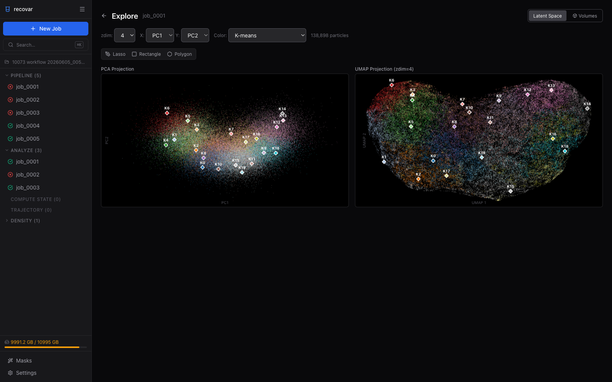

# Extracting Image Subsets

RECOVAR can identify which images contributed to a particular feature in a generated volume — for example, to pull out the particles behind one conformational state and re-import them into RELION or cryoSPARC for focused refinement.

## Based on volume features

The `extract_image_subset` command identifies images that produced a particular region of a volume.

```bash
recovar extract_image_subset \
    output/analysis_10/kmeans \
    --output subset_indices.pkl \
    --mask feature_mask.mrc
```

### Specifying the region of interest

Choose one of:

| Method | Flag | Description |
|--------|------|-------------|
| Mask file | `--mask mask.mrc` | Center of mass of mask defines the region |
| Coordinates | `--coordinate 50,50,50` | Pixel coordinates of the feature |
| Subvolume index | `--subvol-idx 3` | Direct subvolume index |

!!! note
    The mask's center of mass is used to identify the region. Non-convex masks may give unexpected results — use a simple spherical or box mask around the feature of interest.

### Input directory

The first positional argument should be a volume directory generated by `analyze`, `compute_state`, or `compute_trajectory`. For example:

```
output/analysis_10/kmeans/
```

## Based on k-means clusters

Extract particles belonging to specific k-means clusters:

```bash
# Keep particles in clusters 0 and 3
recovar extract_image_subset_from_kmeans \
    output/analysis_10/data/kmeans_result.pkl \
    subset_indices \
    0,3

# Keep everything EXCEPT clusters 0 and 3
recovar extract_image_subset_from_kmeans \
    output/analysis_10/data/kmeans_result.pkl \
    subset_indices \
    0,3 -i
```

The output is written to `subset_indices/indices.pkl`.

### Arguments

| Argument | Description |
|----------|-------------|
| `path_to_centers` | Path to `kmeans_result.pkl` from analyze (in `data/`) |
| `output_path` | Output directory (indices saved as `indices.pkl` inside) |
| `kmeans_indices` | Comma-separated cluster indices to keep |
| `-i`, `--inverse` | Invert selection (exclude specified clusters) |

## Using extracted subsets

The commands above write a `.pkl` file containing indices, not a native RELION-5
tomography input. Only load pickle files and RECOVAR results from trusted sources:
loading a pickle can execute code.

For single-particle data, the following example creates a filtered STAR file
**only if the indices refer directly to its rows in exactly the same order**:

```python
import pickle, starfile

with open("subset_indices.pkl", "rb") as f:
    indices = pickle.load(f)

data = starfile.read("particles.star")
data["particles"] = data["particles"].iloc[indices]
starfile.write(data, "particles_subset.star")
```

You can then import `particles_subset.star` back into RELION or cryoSPARC for focused refinement.

!!! warning "Do not select tomography particles by tilt-image row number"
    In cryo-ET, the flat STAR used by RECOVAR has one row per **tilt image**,
    whereas the native RELION particle STAR has one row per **physical particle**.
    Neither applying physical-particle cluster labels to flat STAR rows with
    `.iloc` nor applying RECOVAR indices directly to a differently ordered native
    STAR preserves particle identity. Use the identity-based exporter below.

## Exporting k-means clusters to native RELION-5 tomography

The local `export_relion5_tomo_clusters` command selects native RELION particle
rows using RECOVAR's physical-particle cluster labels. It does not copy image
stacks, submit jobs, or convert flat tilt-image poses back into native tomography
poses. Use the checkout containing this command; this example does not assume
that it is available in an older installed RECOVAR release.

Provide the completed Pipeline and Analyze directories, the native particle STAR
to subset, and its corresponding tomogram STAR:

```bash
recovar export_relion5_tomo_clusters \
    --pipeline /path/to/Pipeline/job_0001 \
    --analysis /path/to/Analyze/k3/job_0001 \
    --particles /path/to/RELION/Refine3D/job012/run_data.star \
    --tomograms /path/to/RELION/tomograms.star \
    --datadir /path/to/RELION \
    --outdir /path/to/new_relion_clusters
```

`--particles` is the **native RELION-5 tomography STAR**, not RECOVAR's flattened
`particles_2d.star`. This exporter supports native **2D particle tilt stacks**,
not 3D pseudo-subtomograms. The STAR must describe the extracted stacks that
RELION should read next. For example, labels from a D64 RECOVAR run can select D128 native
particles when their particle IDs match. The exporter changes membership, not
pixel size, image data, or pose units.

### Identity mapping and input paths

The exporter uses the Pipeline's saved physical-particle halfsets
(`model/particles_halfsets.pkl`) together with its flat particle STAR to recover
the mapping between analyzed particles and the canonical, lexically sorted
`rlnGroupName` identities. It matches these identities to
`rlnTomoParticleName` in the supplied native STAR. It does **not** assume that
native STAR row order equals RECOVAR particle order.

- The flat STAR is recovered from the Pipeline metadata. If its recorded path
  has moved, supply `--flat-particles /path/to/particles_2d.star`; it must describe
  the same particles and grouping used by that Pipeline.
- Missing or ambiguous particle IDs, inconsistent mappings, and invalid label
  assignments are errors; the exporter does not guess a correspondence.
- Legacy label arrays may contain negative padding outside the valid analyzed
  particle indices. Such padding is not an additional cluster and is not used
  to select particles.
- Relative native file references are resolved against `--datadir` when supplied;
  otherwise the source STAR's parent directory is used. Supply the RELION project
  root when references are project-relative, including paths in nested tomogram
  metadata. The exporter copies the small nested tilt-STAR metadata files and
  rebases their micrograph references to absolute paths, preserving any
  `index@stack` prefixes. Numerical geometry is unchanged, and image pixels or
  stacks are not copied. Referenced micrographs must remain available: RELION
  reads the first micrograph's header even when refining extracted particle
  stacks without loading the full tilt-series images.
- If the next RELION job needs an existing motion/trajectory file, pass it
  explicitly with `--trajectories /path/to/trajectories.star`. The exporter adds
  that reference to the optimization set; it does not guess a trajectory file.
  Only named trajectories, with one STAR block per `rlnTomoParticleName`, are
  supported. Every selected particle must have finite XYZ shifts for **all
  tomogram frames**, including invisible frames. Legacy row-indexed motion
  files (`data_0`, `data_1`, ...) are rejected because subsetting particles would
  invalidate their row-based association; trajectories are not converted.

### Selecting clusters and preserving metadata

By default, every cluster is exported into a **separate** directory. Add
`--clusters 0,2` to export only clusters 0 and 2; this does not merge them.
Cluster numbers retain RECOVAR's zero-based labels.

Native Euler angles, XYZ origin shifts, existing halfset assignments, and
visible-frame flags are preserved by default. Optics metadata and additional
STAR blocks are retained. The supplied native STAR is therefore the authority
for poses; no poses are inferred from the flat STAR during export.

For a deliberately fresh alignment, `--reset-poses` zeroes the native Euler
angles and XYZ origin shifts, including existing pose priors. It leaves tomogram
geometry and subtomogram frame transforms unchanged. `--reset-halfsets` removes
`rlnRandomSubset`, allowing RELION to assign new halfsets. These are explicit
options, not required for ordinary subset export; leave them off when continuing
to use the current poses and halfsets.

### Outputs

Use a new or empty output directory; existing exports are not overwritten.
For a three-cluster analysis, the main files are shown below; copied tilt-STAR
metadata files are also written under the output directory.

```text
new_relion_clusters/
  manifest.json
  summary.tsv
  tomograms.star
  particles_classes.star
  cluster0/
    particles.star
    optimisation_set.star
    membership.tsv
  cluster1/
    particles.star
    optimisation_set.star
    membership.tsv
  cluster2/
    particles.star
    optimisation_set.star
    membership.tsv
```

Each `particles.star` is the native subset; `optimisation_set.star` connects that
subset to the exported `tomograms.star`, whose tilt-series STAR references point
to the copied metadata with rebased image paths. The geometry values and
original pixel files are unchanged. An explicitly supplied trajectory file is
also referenced by the optimization set. The membership tables record the selected
particle identities, and the root summary reports cluster counts. The manifest
records the export inputs and options for auditing.

Check that `manifest.json` has `"status": "completed"`, and inspect the counts and
memberships before starting a separate RELION InitialModel, Class3D, or Refine3D
job. Exporting subsets does not run any of those jobs. A configurable
shell example is available at
[`docs/examples/export_relion5_tomo_clusters.sh`](../examples/export_relion5_tomo_clusters.sh).

### One STAR with class numbers

The export also writes `particles_classes.star` at the output root: the native
particle STAR with every particle RECOVAR retained, from all clusters whatever
`--clusters` selects, and a `rlnClassNumber` column. RELION class numbers start
at 1 and RECOVAR cluster IDs at 0, so **`rlnClassNumber` = cluster ID + 1**
(cluster 0 is class 1). An `rlnClassNumber` already in the source STAR is
replaced. Poses and `rlnRandomSubset` are kept from the source STAR even with
`--reset-poses` or `--reset-halfsets`, and source particles that the pipeline did
not retain are left out; `manifest.json` records the per-class counts and how
many were left out.

To separate one cluster further, run the pipeline on that cluster's own
`clusterN/particles.star` with the exported `tomograms.star`, analyze, and export
again.

## Using the GUI

For native RELION-5 tomography, use the identity-based command above. The GUI's
row-based STAR export is not a replacement for this native tomography exporter.

In the web GUI's **Latent Space Explorer** (available after running Analyze), you can pick particles interactively with the lasso, rectangle, or polygon tools -- no command line needed.



1. Open a completed pipeline or analyze job and click **Explore Latent Space**
2. Use the selection tools to draw a region on the PCA or UMAP scatter plot
3. The number of selected particles is displayed immediately
4. Click **Export .star** to save the selected particles as a RELION-compatible `.star` file (if the source job has no `.star` to copy from, the GUI exports a `.ind` index file instead)
5. A link to **rerun pipeline** with the exported subset appears for one-click re-processing

See the [GUI Guide](gui.md) for details.
