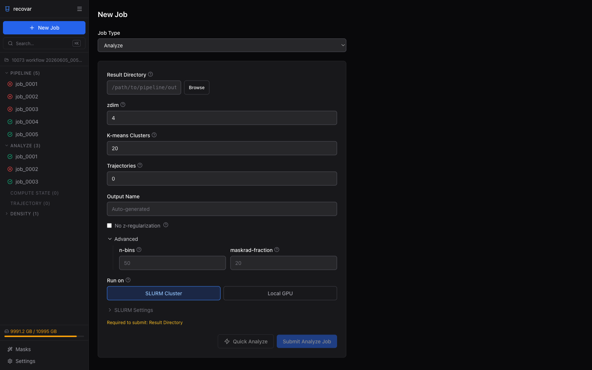
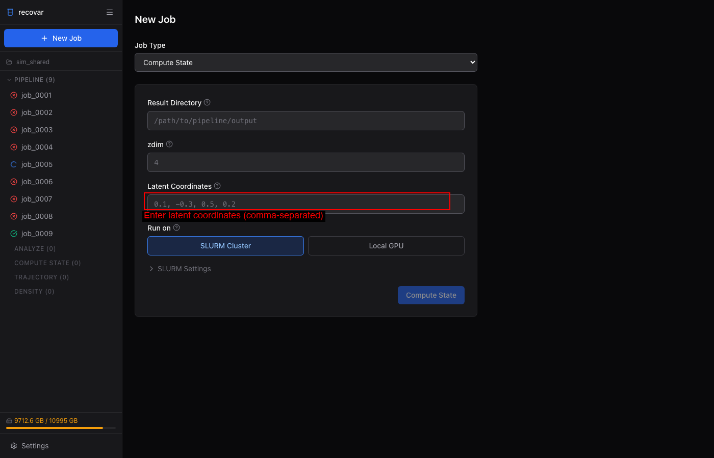
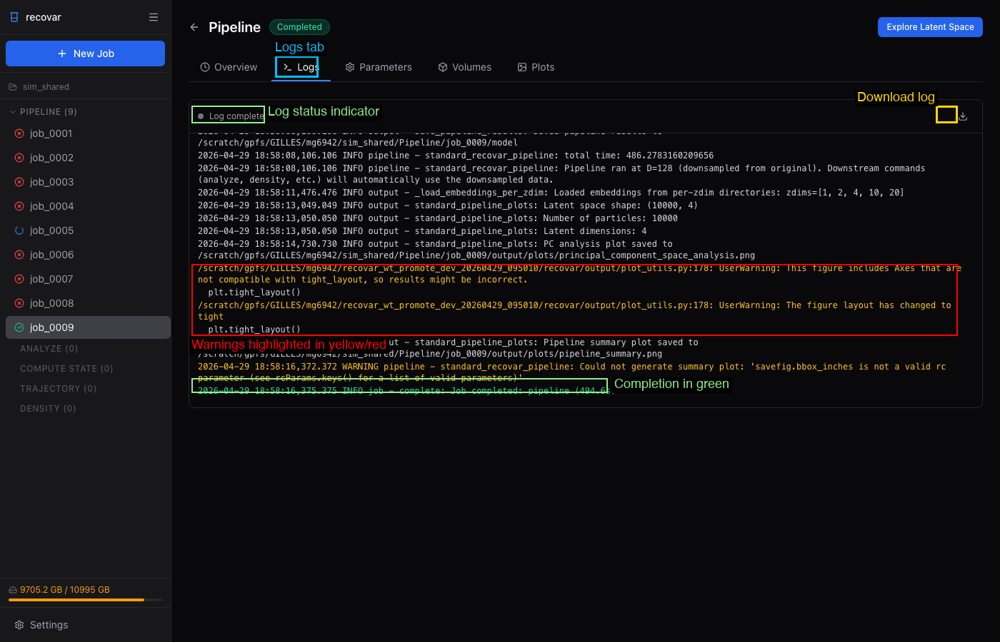
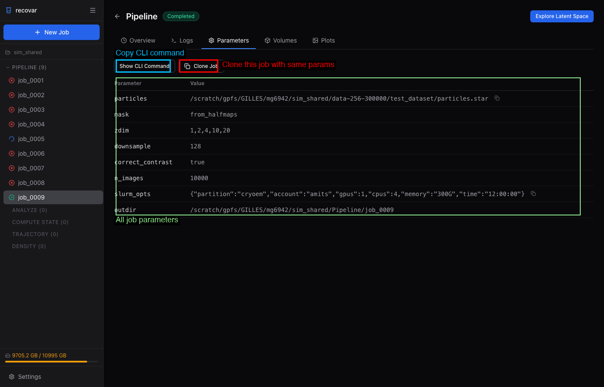
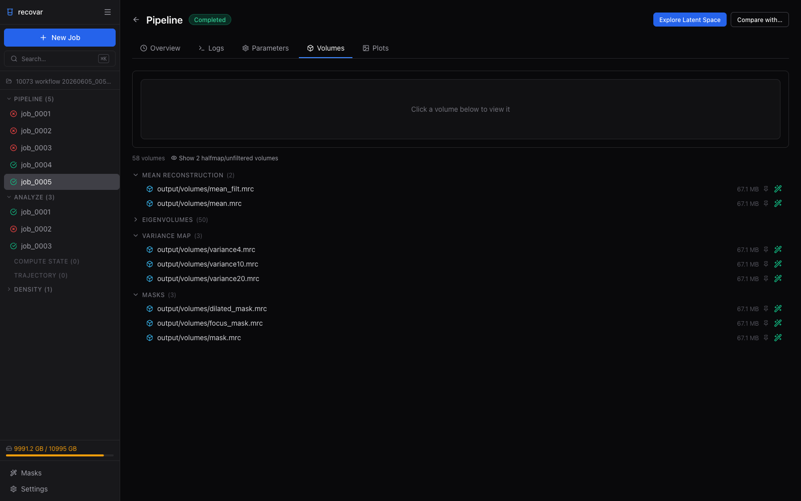
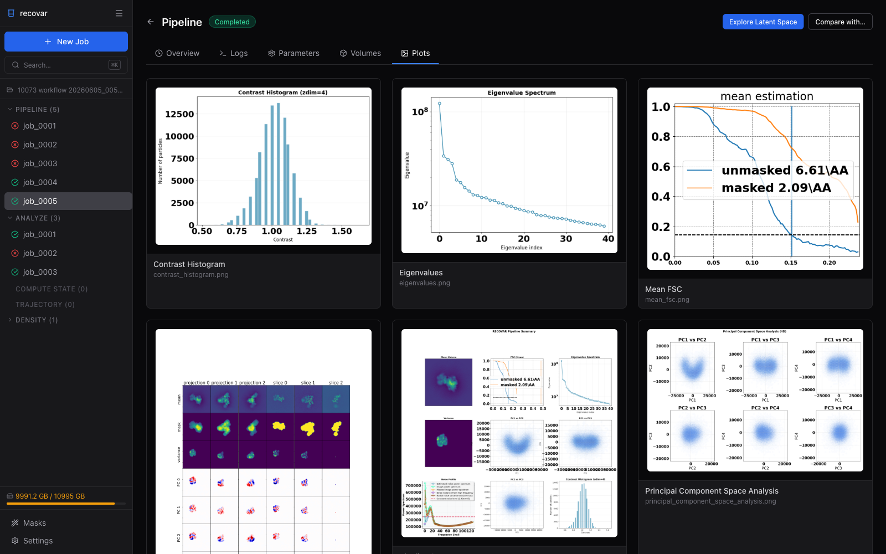

# Web GUI

RECOVAR includes a browser-based GUI for launching jobs, exploring latent spaces interactively, and viewing 3D volumes -- all without writing commands. This guide walks through every screen and feature with annotated screenshots.

## Launching the GUI

```bash
recovar gui
```

This starts a local web server (default: `http://localhost:8080`). Open the URL in your browser.

### Options

| Flag | Default | Description |
|------|---------|-------------|
| `--port` | 8080 | Port to bind to |
| `--host` | 127.0.0.1 | Host to bind to (`0.0.0.0` for remote access) |
| `--reload` | False | Auto-reload for development |

### Remote access via SSH

When your data lives on a remote cluster and you want to view the GUI in a browser on your laptop, set up an SSH tunnel:

```bash
# Step 1: On your LOCAL machine, open an SSH tunnel:
ssh -L 8080:localhost:8080 user@cluster

# Step 2: On the CLUSTER (inside the SSH session), launch the GUI:
recovar gui

# Step 3: Open http://localhost:8080 in your local browser
```

The tunnel forwards traffic so the remote server appears local. If port 8080 is taken, use a different port in both the SSH command and `recovar gui --port <port>`.


## Getting Started

### First Launch

When you first open the GUI, you will see the initial dashboard with no project loaded. The sidebar offers two actions: **Create Project** and **Open Project**. The system info bar at the top shows the hostname, execution mode (Local or SLURM), recovar version, and available GPUs.


The system info bar is useful for verifying you are connected to the right machine and that GPUs are detected correctly.


### Creating a Project

Click **Create Project** in the sidebar or in the main content area. A dialog opens with a built-in file browser that lets you navigate the filesystem.


To create a project:

1. **Navigate** to the directory where you want the project. Use the breadcrumb bar at the top to jump between parent directories, or click folder names to descend into them.
2. Click **Select this directory** to confirm the location.
3. **Name your project** in the Project Name field (e.g., "my_analysis").
4. Click the blue **Create Project** button.

The GUI creates a `recovar_project.db` SQLite file in that directory. This lightweight database indexes your jobs and results. It is fully rebuildable -- if you ever delete it, you can re-import everything with "Scan for Existing Jobs."


### Opening an Existing Project

Click **Open Project** to open a directory that already contains a recovar project (i.e., has a `recovar_project.db` or pipeline output directories).


Navigate to the project directory using the breadcrumb navigation and directory listing, then click **Select this directory** followed by **Open Project**.


## Dashboard

Once a project is open, the dashboard shows a complete overview of your work.


The dashboard has several key areas:

- **Sidebar job tree** (left) -- All jobs organized by type (Pipeline, Analyze, Compute State, Trajectory, Density). Color-coded status icons show which jobs completed (green check), failed (red circle), or are still running (blue spinner). Click any job to view its details.

- **Job count cards** -- Quick summary showing total jobs and counts per type.

- **Run Pipeline** -- Click to start a new pipeline job. This is the main entry point for processing particles.

- **Scan for Jobs** -- Import existing pipeline outputs that were created outside the GUI (e.g., from the command line). Point to the directory containing your `Pipeline/` output folders.

- **Recent Jobs** -- A chronological list of recent jobs with status badges and output paths.

- **Disk usage** (bottom-left) -- Shows filesystem usage so you can monitor available space.

- **Settings** (bottom-left) -- Configure SLURM and local execution defaults.


## Submitting Jobs

Click **+ New Job** in the sidebar or the top-right corner, or click **Run Pipeline** on the dashboard.


### Pipeline Job

The Pipeline job form is the primary entry point for processing cryo-EM particles.


#### Required fields

- **Job Type** -- Select "Pipeline" from the dropdown. Other job types (Analyze, Compute State, etc.) are also available here.
- **Particles** -- Path to your `.star`, `.cs`, or `.mrcs` particle stack file. Click **Browse** to open the inline file browser.

#### Solvent Mask

Choose how the solvent mask is generated:

- **Auto (from halfmaps)** -- Automatically computed (recommended for most cases)
- **Sphere** -- Simple spherical mask
- **None** -- No solvent mask
- **Custom .mrc file** -- Provide your own mask

#### Focus Mask

Optionally provide a focus mask (`.mrc` file) to restrict analysis to a specific region of the molecule.


#### Advanced Options

Click **Advanced** to expand additional pipeline settings:


- **Output Name** -- Custom name for the output directory (auto-generated if left blank)
- **zdim** -- Comma-separated list of latent space dimensions to compute (default: `1,2,4,10,20`). These represent different levels of conformational complexity.
- **Downsample** -- Target box size for downsampled images (default: 256). Smaller values run faster but lose resolution.
- **Lazy loading** -- Load images on demand rather than all at once (saves memory for large datasets)
- **Correct image scale** -- Apply per-particle contrast correction (recommended)
- **Tilt series** -- Enable for cryo-ET tilt series data
- **Data Directory** -- Override the directory where particle images are stored
- **Strip Prefix** -- Remove a path prefix from particle paths (useful when data has been moved)


#### Rarely Used Options

Expand **Rarely Used** for additional fields:

- **Halfsets** -- Column name for half-set assignment
- **N Images** -- Limit the number of images to process (default: all)
- **Poses** -- Path to external pose file (`.pkl`)
- **CTF** -- Path to external CTF parameters file (`.pkl`)


#### Executor Selection (SLURM or Local GPU)

Each job can be submitted to either a **SLURM cluster** or run directly on the **local GPU**. When `sbatch` is detected on the system, a toggle appears in every job form.

**SLURM Cluster selected:**


When SLURM is selected, expand **SLURM Settings** to configure:

- **Partition** -- SLURM partition name (e.g., `gpu`, `cryoem`)
- **Account** -- SLURM account for billing
- **GPUs** -- Number of GPUs to request (default: 1)
- **CPUs** -- Number of CPU cores (default: 4)
- **Memory** -- Memory allocation (e.g., `300G`)
- **Time Limit** -- Maximum wall time (e.g., `12:00:00`)

These fields are pre-filled from your saved defaults (see [Settings](#settings)).

**Local GPU selected:**


When Local GPU is selected, expand **Local GPU Settings** to configure:

- **GPU picker** -- Click individual GPU buttons to select which GPU(s) to use (sets `CUDA_VISIBLE_DEVICES`)
- **Setup command** -- Shell command run before the pipeline (e.g., `module load cudatoolkit/12.8`)
- **Environment variables** -- Extra environment variables for the job

Click **Submit Pipeline Job** at the bottom to submit.


### Analyze Job

After a pipeline completes, the **Suggested Next Steps** on the job detail page offer a one-click link to run analysis with the result directory pre-filled.



Configure:

- **Result Directory** -- Path to the pipeline output (auto-filled when coming from Suggested Next Steps)
- **zdim** -- Which latent dimension to analyze (default: 4)
- **K-means Clusters** -- Number of clusters for k-means (default: 40)
- **Trajectories** -- Number of trajectory volumes to compute between most-distant cluster pairs
- **Output Name** -- Custom name for the analysis output


### Compute State

Generate a 3D volume at a specific point in latent space.



- **Result Directory** -- Path to the pipeline output
- **zdim** -- Latent dimension
- **Latent Coordinates** -- Comma-separated coordinates in the latent space (e.g., `0.1, -0.3, 0.5, 0.2`)


### Other Job Types

- **Compute Trajectory** -- Generate volumes along a path between two latent points (specify start and end coordinates)
- **Density Estimation** -- Estimate conformational density in latent space
- **Stable States** -- Find local maxima of the conformational density
- **Postprocess** -- Sharpen and filter volumes
- **Downsample** -- Pre-downsample particle images


## Job Detail Page

Click any job in the sidebar or recent jobs list to view its details. The job detail page has multiple tabs.


### Overview Tab

**Completed job:**


A completed pipeline job shows:

- **Status badge** -- Green "Completed" badge
- **Duration** -- How long the job ran (e.g., "8m 48s")
- **Execution details** -- Whether it ran on SLURM (with job ID, partition, account) or locally (with PID)
- **Output Directory** -- Full path to results (click the copy icon to copy)
- **Suggested Next Steps** -- Quick links to run follow-up jobs (e.g., "Analyze this pipeline output", "Estimate conformational density"). These pre-fill the new job form with the correct result directory.
- **Quick Preview** -- Thumbnail plots showing the contrast histogram, eigenvalue spectrum, and mean FSC
- **Volumes available** -- Click to jump to the Volumes tab and browse output volumes
- **Explore Latent Space** button (top-right) -- Opens the interactive latent space explorer (available after running Analyze)


**Running job:**


A running job shows a blue "Running" badge with a **Refresh** button and a red **Cancel** button in the top-right corner.


**Failed job:**


A failed job shows a red "Failed" badge with an error message box. Check the Logs tab for detailed error output.


### Logs Tab



The log viewer shows the full job output with color-coded messages:

- **White** -- Normal log output
- **Yellow/Red** -- Warnings and errors (highlighted for easy scanning)
- **Green** -- Job completion messages

A **download button** (top-right of the log area) lets you save the full log. The status indicator ("Log complete" or "Streaming...") shows whether the log is still being written.

For running jobs, logs stream in real-time via WebSocket.


### Parameters Tab



Shows all parameters used for the job in a clean table format. Two action buttons are available:

- **Show CLI Command** -- Displays the equivalent command-line command, useful for reproducing the run outside the GUI
- **Clone Job** -- Opens a new job form with all parameters pre-filled from this job, so you can resubmit with modifications


### Volumes Tab



Lists all output volumes organized by category:

- **Mean Reconstruction** -- Filtered and unfiltered mean maps
- **Eigenvolumes** -- Principal component volumes (e.g., 50 eigenvolumes)
- **Variance Maps** -- Variance at different latent dimensions
- **Masks** -- Solvent mask, focus mask, dilated mask

Click any volume to load it in the 3D viewer at the top. The viewer renders isosurfaces directly in the browser using vtk.js. File sizes are shown next to each volume. Pin icons let you keep multiple volumes loaded for comparison (up to 4).


### Plots Tab



Displays all diagnostic plots generated by the pipeline as a grid of images:

- **Contrast Histogram** -- Distribution of per-particle contrast values
- **Eigenvalue Spectrum** -- Shows which eigenvalues are significant
- **Mean FSC** -- Fourier Shell Correlation of the mean reconstruction
- **Volume projections/slices** -- Visual summaries of mean and eigenvolumes
- **Pipeline Summary** -- Combined summary plot
- **Principal Component Space Analysis** -- Scatter plots of particles in PC space

Click any plot to view it at full resolution.


## Clone Job Flow

The Clone Job feature lets you quickly resubmit a job with modified parameters:

1. Go to the **Parameters** tab of any completed (or failed) job.
2. Click **Clone Job**.
3. A new job form opens with all parameters pre-filled from the original job.


The particles path, zdim, downsample, and all other parameters are carried over. Modify what you need, then submit. This is useful for:

- Re-running a failed job with corrected settings
- Trying different zdim or downsample values
- Running with a different mask


## Settings

The Settings page (gear icon at the bottom of the sidebar) lets you configure default values for SLURM and local GPU execution. These defaults are pre-filled into every new job form, so you do not have to enter partition, account, and other settings repeatedly.

### SLURM Cluster Tab


The SLURM tab shows three sections:

1. **Effective SLURM Defaults** -- A summary bar at the top showing the current effective values with provenance badges ("user", "project", or "built-in") indicating where each value comes from.

2. **User-Global Defaults** -- Settings that apply to all projects. Stored in `~/.config/recovar/config.toml`. Set your cluster partition and account here so they are available for every project.

3. **Project Defaults** -- Settings that override user-global defaults for this specific project. Stored in `<project_dir>/recovar.toml`. Useful when different projects need different partitions or resource allocations.

Each section has a **Save** button. Values cascade: built-in defaults are overridden by user-global, which are overridden by project, which are overridden by per-job form values.


### Local GPU Tab


The Local GPU tab follows the same layered structure:

- **GPU picker buttons** -- Shows all available GPUs with model names. Click to select/deselect. Selected GPUs are highlighted in blue.
- **Setup command** -- A shell command to run before every local job (e.g., `module load cudatoolkit/12.8`). Useful on clusters where GPU software requires module loading.
- **Environment variables** -- Add key-value pairs for extra environment variables.
- **Save User Defaults / Save Project Defaults** -- Persist your choices.


## Exploring Results

### Latent Space Explorer

After running an Analyze job, click the **Explore Latent Space** button (top-right of a completed pipeline or analyze job) to open the interactive latent space explorer.

The explorer shows scatter plots of all particles in the latent space (50K+ points rendered at 60 fps via WebGL):

- **PCA and UMAP** projections side by side
- **Color by** k-means cluster, point density, or deconvolved conformational density
- **Selectable zdim** -- Switch between latent dimensions (1, 2, 4, 10, 20, etc.)
- Axis selectors for PCA components

#### Point clicks

Click a particle or k-means center to see its full latent coordinate vector and density value. From there:

- **Compute State** -- Submit a job to generate a volume at that point
- **Compute Trajectory** -- Select two points and submit a trajectory job

#### Lasso / rectangle / polygon selection

Use the selection tools to draw a region on the scatter plot:

- See the number of selected particles
- **Export .star** -- One-click export of selected particles as a RELION .star file
- **Export .ind** -- Export particle indices as an index file
- A link to **rerun pipeline** with the exported subset appears immediately


### 3D Volume Viewer

View isosurface renderings of any volume directly in the browser:

- Adjustable **sigma threshold** for isosurface level
- **Slice view** with axis selection and slider navigation
- Click volumes in the **Volumes** tab to load them
- Pin up to 4 volumes simultaneously for comparison


## GUI vs CLI Workflow

The GUI mirrors the CLI workflow, adding interactivity:

| CLI step | GUI equivalent |
|----------|----------------|
| `recovar pipeline ...` | New Job -> Pipeline form |
| `recovar analyze ...` | New Job -> Analyze form (or click "Suggested Next Step") |
| `recovar compute_state ...` | Click a point in the latent space explorer, or New Job -> Compute State form |
| `recovar compute_trajectory ...` | Select two points in the latent space explorer, or New Job -> Trajectory form |
| View `.mrc` in ChimeraX | Built-in 3D volume viewer and slice viewer |
| Inspect `.png` plots | Plots tab on the job detail page |
| `recovar estimate_conformational_density ...` | New Job -> Density Estimation form |

!!! tip "Use both"
    The GUI and CLI work on the same output directories. You can run `pipeline` and `analyze` from the command line, then launch `recovar gui` and scan the directory to explore the results interactively. Or do everything through the GUI.


## Jobs Survive GUI Restarts

Jobs submitted through the GUI (both SLURM and local) are tracked in the project database. If the GUI server restarts, it reconnects to all in-flight jobs automatically -- no work is lost. SLURM jobs are tracked by their job ID, and local jobs are tracked by PID.


## Requirements

The GUI requires FastAPI, uvicorn, SQLAlchemy, and a few other packages, which are all included when you install with:

```bash
pip install "recovar[gui]"
```

This installs the `gui` extra, which includes `fastapi`, `uvicorn`, `python-multipart`, `sqlalchemy`, `aiofiles`, and `tomli_w` (for writing TOML settings files).

The frontend is pre-built and bundled -- no Node.js required at runtime.
