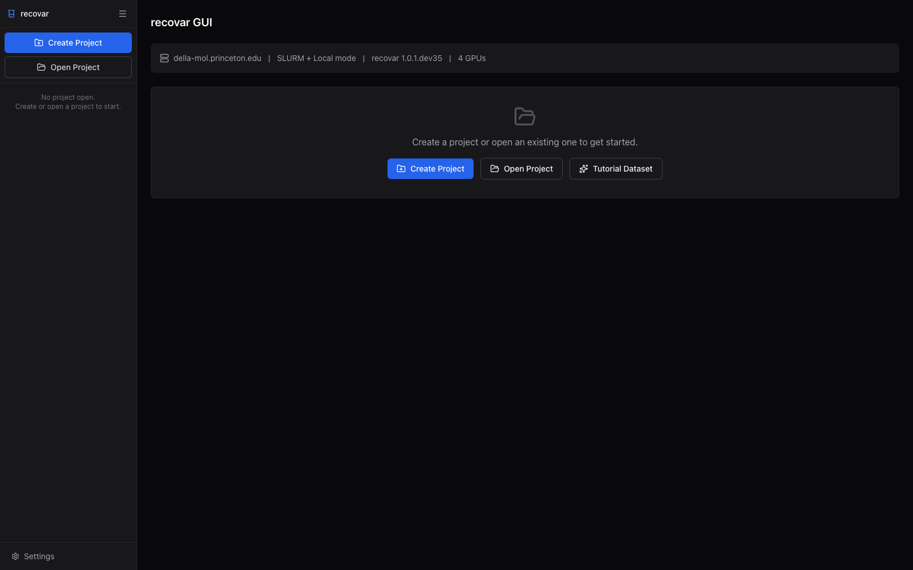
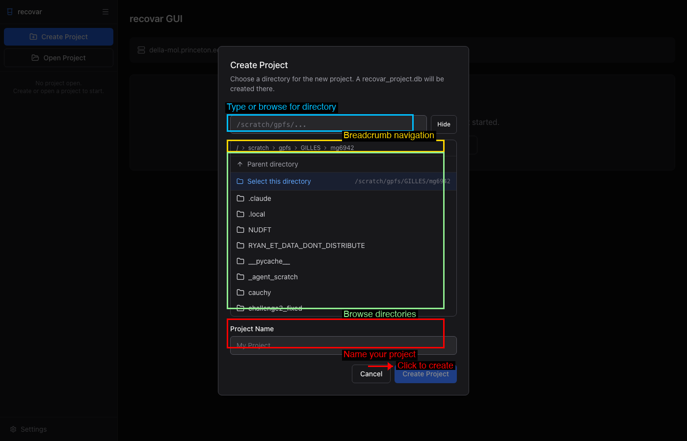
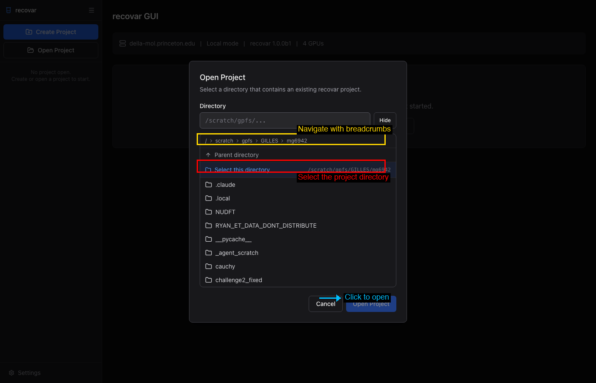
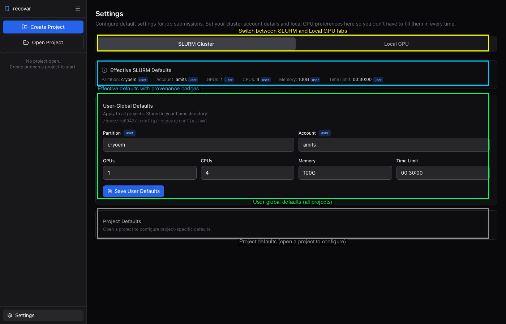
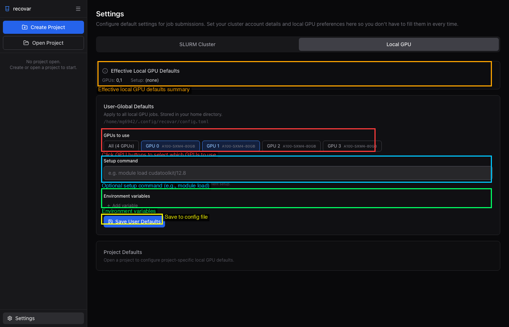
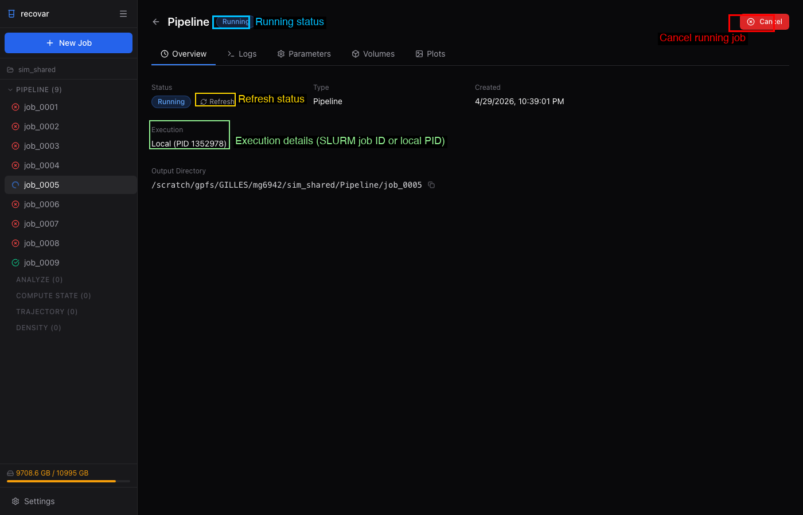
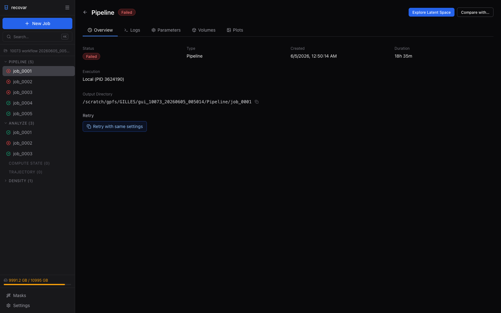
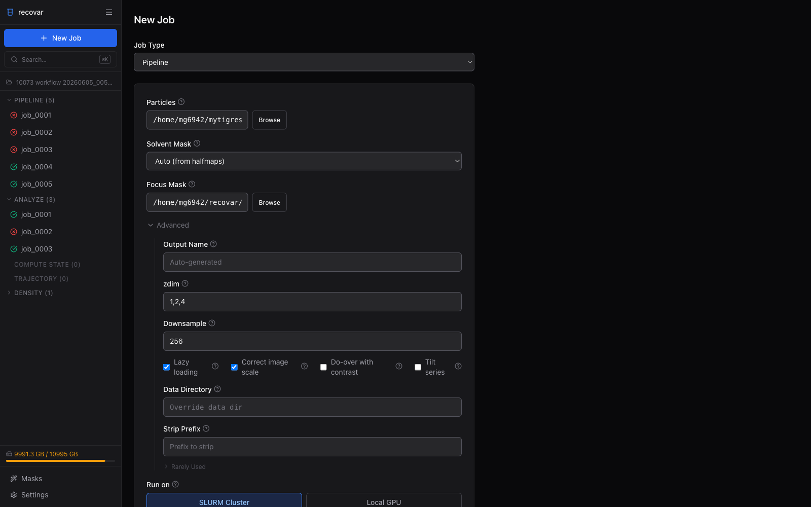

# Web GUI

RECOVAR includes a browser-based GUI for launching jobs, exploring latent spaces interactively, and viewing 3D volumes -- all without writing commands.

## Launching the GUI

```bash
recovar gui
```

This starts a local web server (default: `http://localhost:8080`). Open the URL in your browser.

### Options

| Flag | Default | Description |
|------|---------|-------------|
| `--port` | 8080 | Port to bind to |
| `--host` | 127.0.0.1 | Host to bind to (`0.0.0.0` for remote access) |
| `--reload` | False | Auto-reload for development |

### Remote access via SSH

When your data lives on a remote cluster and you want to view the GUI in a browser on your laptop, set up an SSH tunnel:

```bash
# Step 1: On your LOCAL machine, open an SSH tunnel:
ssh -L 8080:localhost:8080 user@cluster

# Step 2: On the CLUSTER (inside the SSH session), launch the GUI:
recovar gui

# Step 3: Open http://localhost:8080 in your local browser
```

The tunnel forwards traffic so the remote server appears local. If port 8080 is taken, use a different port in both the SSH command and `recovar gui --port <port>`.


## Getting Started

### First Launch

When you first open the GUI, you will see the initial dashboard with no project loaded. The sidebar offers two actions: **Create Project** and **Open Project**. The system info bar at the top shows the hostname, execution mode (Local or SLURM), recovar version, and available GPUs.



### Creating a Project

Click **Create Project** in the sidebar or in the main content area. A dialog opens with a built-in file browser that lets you navigate the filesystem.



To create a project:

1. **Navigate** to the directory where you want the project.
2. Click **Select this directory** to confirm the location.
3. **Name your project** in the Project Name field.
4. Click the blue **Create Project** button.

The GUI creates a `recovar_project.db` SQLite file in that directory.


### Opening an Existing Project

Click **Open Project** to open a directory that already contains a recovar project.




## Dashboard

Once a project is open, the dashboard shows a complete overview of your work.


Key areas:

- **Sidebar job tree** (left) -- All jobs organized by type with color-coded status icons
- **Job count cards** -- Quick summary of total jobs and counts per type
- **Run Pipeline / Scan for Jobs** -- Start a new pipeline job or import existing CLI outputs
- **Recent Jobs** -- Chronological list with status badges
- **Disk usage** (bottom-left) -- Filesystem usage monitor
- **Settings** (bottom-left) -- Configure SLURM and local execution defaults


## Settings

The Settings page (gear icon at the bottom of the sidebar) lets you configure default values for SLURM and local GPU execution. These defaults are pre-filled into every new job form.

### SLURM Cluster Tab



Three sections with cascading priority:

1. **Effective SLURM Defaults** -- Summary bar showing current values with provenance badges ("user", "project", or "built-in")
2. **User-Global Defaults** -- Settings for all projects, stored in `~/.config/recovar/config.toml`
3. **Project Defaults** -- Per-project overrides, stored in `<project_dir>/recovar.toml`

### Local GPU Tab



Same layered structure with GPU-specific options:

- **GPU picker buttons** -- Select which GPUs to use (sets `CUDA_VISIBLE_DEVICES`)
- **Setup command** -- Shell command run before every local job (e.g., `module load cudatoolkit/12.8`)
- **Environment variables** -- Extra environment variables for jobs


## Submitting Jobs

Click **+ New Job** in the sidebar or the dashboard. Each job type has its own form. For detailed screenshots and field descriptions, see the relevant guide page:

- **Pipeline** -- See [Running the Pipeline](pipeline.md#using-the-gui)
- **Analyze** -- See [Analyzing Results](analysis.md#using-the-gui)
- **Downsample** -- See [Downsampling](downsampling.md#using-the-gui)
- **Density Estimation** -- See [Conformational Density](conformational-density.md#using-the-gui)
- **Compute State** -- Generate a 3D volume at a specific latent coordinate
- **Compute Trajectory** -- Generate volumes along a path between two latent points
- **Stable States** -- Find local maxima of the conformational density
- **Postprocess** -- Sharpen and filter volumes

Each form includes an executor toggle (SLURM Cluster or Local GPU) with configurable resource settings.


## Job Detail Page

Click any job in the sidebar to view its details. The job detail page has multiple tabs:

- **Overview** -- Status, duration, execution details, output directory, suggested next steps, and quick preview plots
- **Logs** -- Full job output with color-coded messages and real-time streaming for running jobs
- **Parameters** -- All parameters used, with **Show CLI Command** and **Clone Job** buttons
- **Volumes** -- Output volumes organized by category, with a built-in 3D isosurface viewer
- **Plots** -- All diagnostic plots in a grid (click to view full resolution)

**Completed job:**


**Running job:**



**Failed job:**




## Clone Job Flow

From the **Parameters** tab of any job, click **Clone Job** to open a new form with all parameters pre-filled. Modify what you need and resubmit.




## Exploring Results

### Latent Space Explorer

After running an Analyze job, click **Explore Latent Space** to open the interactive explorer:

- **PCA and UMAP** projections side by side (50K+ points at 60 fps via WebGL)
- **Color by** k-means cluster, point density, or deconvolved conformational density
- **Click** a particle or k-means center to see its coordinates and generate a volume
- **Lasso / rectangle / polygon selection** to select particles and export `.star` or `.ind` files (see [Extracting Subsets](extracting-subsets.md#using-the-gui))

### 3D Volume Viewer

View isosurface renderings of any volume directly in the browser with adjustable sigma threshold, slice views, and side-by-side comparison of up to 4 volumes.


## GUI vs CLI Workflow

The GUI mirrors the CLI workflow, adding interactivity:

| CLI step | GUI equivalent |
|----------|----------------|
| `recovar pipeline ...` | New Job -> Pipeline form |
| `recovar analyze ...` | New Job -> Analyze form (or click "Suggested Next Step") |
| `recovar compute_state ...` | Click a point in the latent space explorer, or New Job -> Compute State form |
| `recovar compute_trajectory ...` | Select two points in the latent space explorer, or New Job -> Trajectory form |
| View `.mrc` in ChimeraX | Built-in 3D volume viewer and slice viewer |
| Inspect `.png` plots | Plots tab on the job detail page |
| `recovar estimate_conformational_density ...` | New Job -> Density Estimation form |

!!! tip "Use both"
    The GUI and CLI work on the same output directories. You can run `pipeline` and `analyze` from the command line, then launch `recovar gui` and scan the directory to explore the results interactively. Or do everything through the GUI.


## Jobs Survive GUI Restarts

Jobs submitted through the GUI (both SLURM and local) are tracked in the project database. If the GUI server restarts, it reconnects to all in-flight jobs automatically -- no work is lost.


## Requirements

The GUI requires FastAPI, uvicorn, SQLAlchemy, and a few other packages, which are all included when you install with:

```bash
pip install "recovar[gui]"
```

This installs the `gui` extra, which includes `fastapi`, `uvicorn`, `python-multipart`, `sqlalchemy`, `aiofiles`, and `tomli_w` (for writing TOML settings files).

The frontend is pre-built and bundled -- no Node.js required at runtime.
