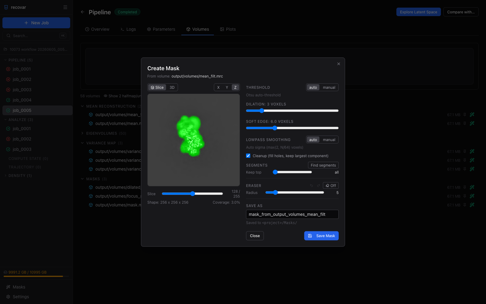
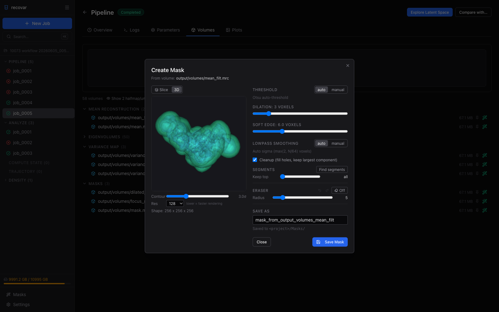

# Masks

A real-space mask is important to boost SNR by focusing the analysis on the region of interest.

## Using the GUI: the Mask Wizard

To make a solvent or focus mask in the GUI, use the built-in **Mask Wizard**. Open any job's **Volumes** tab and click the green wand icon on a volume (usually the mean reconstruction) to launch it.



The wizard builds a mask from the volume and previews it live as you adjust:

- **Threshold** -- automatic (Otsu) or a manual density cutoff
- **Dilation** -- expand the mask outward by a number of voxels
- **Soft edge** -- width of the cosine falloff at the mask boundary
- **Lowpass smoothing** -- automatic or manual, to smooth the surface
- **Cleanup** -- fill interior holes and keep only the largest connected component
- **Segments** -- run connected-component analysis and keep the *N* largest blobs

Switch between the **Slice** view (scroll through X / Y / Z planes with the green mask overlaid) and the **3D** isosurface view:



Click **Save Mask** to write the result to `<project>/Masks/`. It is then available as a solvent or focus mask in any new Pipeline job, and in the **Masks** library (sidebar), where you can combine masks with union / intersect / subtract.

The rest of this page covers the equivalent command-line options.

## Solvent mask

Most consensus reconstruction software outputs a solvent mask. Use it directly:

```bash
recovar pipeline particles.star -o output --mask mask.mrc
```

!!! warning
    Make sure the mask is not too tight. Use `--mask-dilate-iter` to expand it if needed.

### Auto-generated masks

If you don't have a mask:

| Option | Description |
|--------|-------------|
| `--mask=from_halfmaps` | Estimate mask from the mean reconstruction (averages half-maps, low-pass filters, Otsu thresholds, cleans up, and softens) |
| `--mask=sphere` | Use a loose spherical mask |
| `--mask=none` | No mask (not recommended) |

A good approach is to first run with `--mask=sphere`, inspect the variance map to see which regions have heterogeneity, then create a focused mask around those regions.

## Focus mask

A focus mask restricts the heterogeneity analysis to a specific region of the molecule, such as a single domain or binding site.

```bash
recovar pipeline particles.star -o output \
    --mask mask.mrc --focus-mask focus_mask.mrc
```

If you only have a focus mask:

```bash
recovar pipeline particles.star -o output \
    --mask=sphere --focus-mask focus_mask.mrc
```

### Creating a focus mask

Use the [Mask Wizard](#using-the-gui-the-mask-wizard) above: open the mean reconstruction, set a threshold, and use the **Segments** control to keep only the connected region of interest.

You can also build one in UCSF Chimera or ChimeraX:

1. Open your consensus map
2. Select the region of interest
3. Create a mask around that region
4. Save as `.mrc`

See [cryoSPARC's guide on mask generation](https://guide.cryosparc.com/processing-data/tutorials-and-case-studies/mask-selection-and-generation-in-ucsf-chimera) for step-by-step instructions.

## Mask dilation

To expand a mask by a few pixels:

```bash
recovar pipeline particles.star -o output \
    --mask mask.mrc --mask-dilate-iter 5
```

The `--mask-dilate-iter` flag applies to both the solvent mask and the focus mask.
