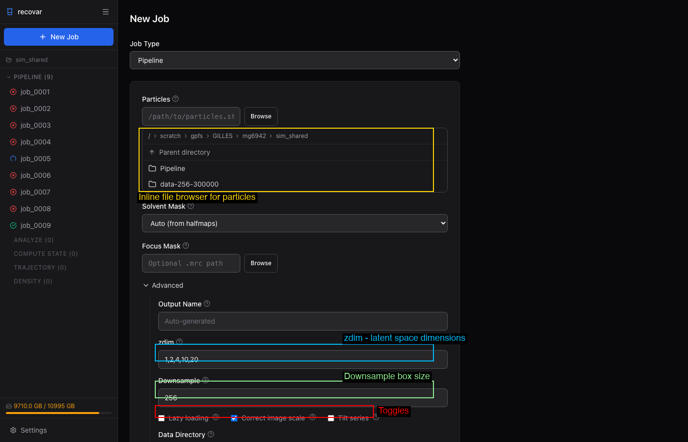
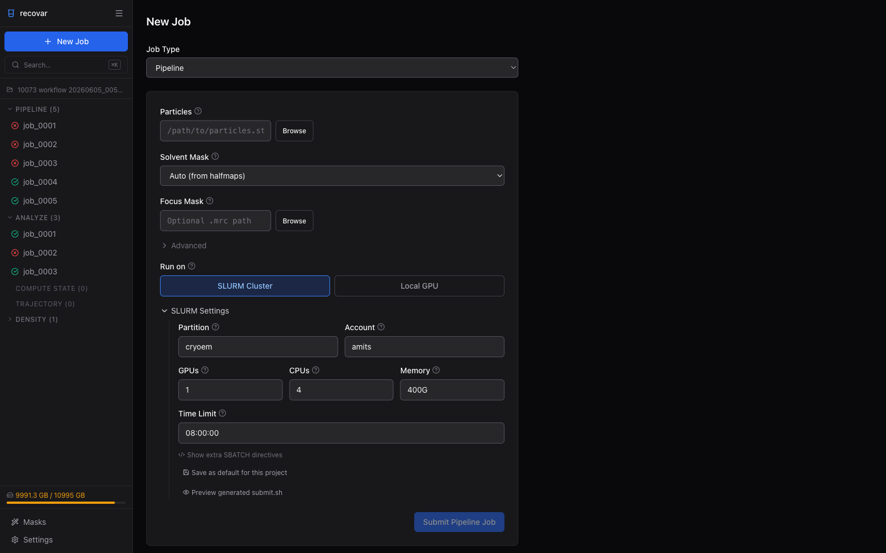
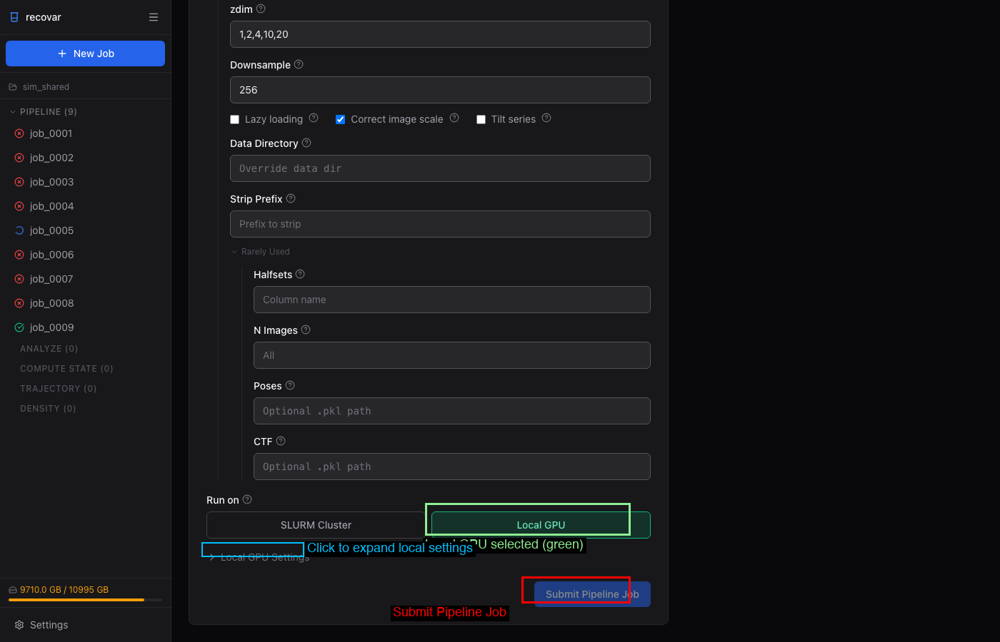

# Running the Pipeline

The RECOVAR pipeline takes particle images and a mask, then computes the mean reconstruction, covariance, principal components, and embeddings.

!!! example "Choose your workflow: :octicons-terminal-16: **CLI** or :material-monitor: **GUI**"
    This page has tabbed instructions for both the **command line** and the **web GUI**. Click the tab headers below each section to switch. Your choice is remembered across all pages. [How to launch the GUI →](gui.md#launching-the-gui)

## Submitting a pipeline job

=== ":material-monitor: GUI"

    

    1. Click **+ New Job** in the sidebar
    2. Select **Pipeline** from the Job Type dropdown
    3. Browse to your particles file (`.star`, `.cs`, or `.mrcs`)
    4. Choose a solvent mask (Auto, Sphere, None, or custom `.mrc`)
    5. Choose **SLURM Cluster** or **Local GPU** under "Run on"
    6. Click **Submit Pipeline Job**

=== ":octicons-terminal-16: CLI"

    ```bash
    # Recommended: run inside a project
    recovar init_project my_project
    cd my_project
    recovar pipeline particles.star --mask mask.mrc --project .

    # cryoSPARC cs file
    recovar pipeline particles.cs --mask mask.mrc --datadir /project/ --project .

    # With downsampling
    recovar pipeline particles.star --mask mask.mrc --downsample 128 --project .

    # Standalone explicit output directory (still supported)
    recovar pipeline particles.star -o output --mask mask.mrc

    # Legacy pickle files
    recovar pipeline particles.128.mrcs -o output \
        --poses poses.pkl --ctf ctf.pkl --mask mask.mrc
    ```

## Required arguments

| Argument | Description |
|----------|-------------|
| `particles` | Input particles (`.star`, `.cs`, `.mrcs`, or `.txt`) |
| `-o`, `--outdir` | Output directory (optional in project mode) |
| `--mask` | Solvent mask (`.mrc`), or `from_halfmaps`, `sphere`, `none` |

## Common options

=== ":material-monitor: GUI"

    

    Expand the **Advanced** section in the job form to set:

    - **zdim** -- PCA dimensions (default: 1,2,4,10,20)
    - **Downsample** -- target box size (e.g., 128)
    - **Lazy loading** -- for large datasets
    - **Correct image scale** -- amplitude scaling correction
    - **Focus Mask** -- browse to a custom focus mask
    - **Tilt series** -- enable for cryo-ET data

    Under **Rarely Used**: Poses, CTF, N Images, Halfsets.

=== ":octicons-terminal-16: CLI"

    | Flag | Default | Description |
    |------|---------|-------------|
    | `--downsample D` | None | Downsample images to box size D (pre-downsamples to disk) |
    | `--poses` | Auto | Poses file (`.pkl`). Auto-extracted from `.star`/`.cs` |
    | `--ctf` | Auto | CTF file (`.pkl`). Auto-extracted from `.star`/`.cs` |
    | `--focus-mask` | None | Focus mask for targeted heterogeneity |
    | `--mask-dilate-iter` | 0 | Dilate the mask by this many iterations |
    | `--zdim` | 1,2,4,10,20 | PCA dimensions for embedding |
    | `--only-mean` | False | Only compute the mean (fast, for verifying setup) |
    | `--correct-contrast` | False | Estimate and correct amplitude scaling |
    | `--lazy` | False | Lazy loading for large datasets |
    | `--multi-gpu` | False | Multi-GPU parallelization (experimental) |

## Execution settings

=== ":material-server-network: SLURM Cluster"

    

    When submitting to SLURM (either from the GUI or CLI on a cluster), configure:

    - **Partition** and **Account** — your cluster allocation
    - **GPUs**, **CPUs**, **Memory**, **Time limit**

    These can be saved as defaults in **Settings** (gear icon in sidebar) so you don't have to fill them in every time.

    ```bash
    # CLI: SLURM submission is handled by the GUI automatically.
    # From the CLI, submit via your cluster's sbatch:
    sbatch --partition=gpu --gres=gpu:1 --mem=100G --time=12:00:00 \
        --wrap="recovar pipeline particles.star --mask mask.mrc -o output"
    ```

=== ":material-desktop-tower: Local GPU"

    

    Run directly on the current machine's GPUs without SLURM:

    - **GPU picker** — select specific GPUs or use all
    - **Setup command** — e.g., `module load cudatoolkit/12.8`
    - **Environment variables** — extra env vars for the job

    ```bash
    # CLI equivalent: just run directly
    recovar pipeline particles.star --mask mask.mrc -o output

    # Select specific GPUs
    CUDA_VISIBLE_DEVICES=0,1 recovar pipeline particles.star --mask mask.mrc -o output
    ```

## Dataset loading options

| Flag | Default | Description |
|------|---------|-------------|
| `--datadir` | None | Path prefix for resolving relative image paths |
| `--strip-prefix` | None | Strip prefix from image paths |
| `--ind` | None | Filter to specific image indices (`.pkl`) |
| `--particle-ind` | None | Filter particles by indices (cryo-ET only, `.pkl`) |
| `--n-images` | All | Number of images to use |
| `--halfsets` | None | Pre-computed half-set split (`.pkl`) |
| `--padding` | 0 | Real-space padding |
| `--uninvert-data` | automatic | Data sign inversion: `true`, `false`, or `automatic` |

## Advanced options

| Flag | Default | Description |
|------|---------|-------------|
| `--noise-model` | radial | Noise model: `radial` or `white` |
| `--mean-fn` | triangular | Mean function: `triangular` or `triangular_reg` |
| `--gpu-gb` | All | GPU memory limit in GB |
| `--n-gpus` | All | Number of GPUs to use |
| `--keep-intermediate` | False | Save intermediate results |
| `--accept-cpu` | False | Allow running without GPU |
| `--ignore-zero-frequency` | False | Useful if images are normalized to zero mean |
| `--low-memory-option` | False | Lower memory for covariance estimation |
| `--very-low-memory-option` | False | Lowest memory for covariance estimation |
| `--premultiplied-ctf` | False | Input images have pre-multiplied CTF |

## Multi-GPU (experimental)

Multi-GPU support parallelizes the covariance estimation step across GPUs. This is the most expensive step of the pipeline, so multi-GPU can significantly reduce total runtime for large datasets.

```bash
# Use all available GPUs
recovar pipeline particles.star -o output --mask mask.mrc --multi-gpu

# Use specific number of GPUs
recovar pipeline particles.star -o output --mask mask.mrc --multi-gpu --n-gpus 4
```

!!! warning "Work in progress"
    Multi-GPU is experimental. It parallelizes covariance estimation only — the mean reconstruction and embedding steps still run on a single GPU. If you run into issues, drop `--multi-gpu` and the pipeline will run normally on one GPU.

### GPU memory and device selection

```bash
# Limit memory per GPU (useful on shared machines)
recovar pipeline particles.star -o output --mask mask.mrc --gpu-gb 8

# Select specific GPUs by ID
CUDA_VISIBLE_DEVICES=0,2 recovar pipeline particles.star -o output --mask mask.mrc --multi-gpu

# Disable JAX memory preallocation (useful on shared machines)
XLA_PYTHON_CLIENT_PREALLOCATE=false recovar pipeline ...
```

## Cryo-ET options

| Flag | Default | Description |
|------|---------|-------------|
| `--tilt-series` | False | Use tilt-series data |
| `--tilt-series-ctf` | Auto | CTF model: `cryoem`, `relion5`, `warp` |
| `--dose-per-tilt` | From file | Dose per tilt |
| `--angle-per-tilt` | From file | Angle per tilt |
| `--ntilts` | All | Number of tilts per series |

See [Cryo-ET](cryo-et.md) for details.

## Output structure

```
output/
  job.json                 # Job metadata (version, timing, parameters)
  command.txt              # Command that was run
  run.log                  # Full log
  README.txt               # Human-readable output summary
  downsampled/             # Pre-downsampled images (if --downsample used)
    particles.128.mrcs
    particles.128.star
  model/                   # Internal model data
    params.pkl             # Pipeline parameters
    zdim_4/                # Per-zdim embedding directories
      latent_coords.npy    # Latent coordinates for zdim=4
    zdim_10/
      latent_coords.npy
    ...
  output/
    volumes/
      mean.mrc             # Mean reconstruction
      mean_filt.mrc        # Filtered mean
      mean_half1_unfil.mrc # Unfiltered half-map 1
      mean_half2_unfil.mrc # Unfiltered half-map 2
      mask.mrc             # Solvent mask used
      dilated_mask.mrc     # Dilated mask
    plots/                 # Diagnostic plots
  analysis_*/              # Results per zdim (after running analyze)
```

When using the **project system** (`--project`), pipeline output is placed into auto-numbered directories like `Pipeline/job_0001/`. The numbered directories stay stable on disk, while RECOVAR records human-readable job names in project metadata for the CLI and GUI.

## Viewing results

=== ":material-monitor: GUI"

    

    After the pipeline completes, the job detail page shows:

    - **Quick Preview** -- contrast histogram, eigenvalue spectrum, mean FSC
    - **Volumes** tab -- browse all output volumes (mean, eigenvolumes, variance maps)
    - **Plots** tab -- all diagnostic plots
    - **Suggested Next Steps** -- one-click links to run Analyze or Density Estimation

=== ":octicons-terminal-16: CLI"

    See the [Tutorial](tutorial.md) for a full worked example with real pipeline output and plots on EMPIAR-10076 (50S ribosome, 131k particles).

## Tips

!!! tip "Recommended starting parameters"
    - **Downsample**: 128 for speed, 256 for quality
    - **zdim**: Start with `1,2,4,10,20` (default). For publication, also try `--zdim 40`
    - **n-images**: Use 10000-50000 for initial exploration, all images for final run
    - **--correct-contrast**: Always enable this unless you know your data is already contrast-corrected

!!! tip "Quick setup check"
    Use `--only-mean` for a fast run that only computes the mean reconstruction. This verifies your data, mask, and CTF are correct before committing to a full run.

!!! tip "Large datasets"
    For datasets > 500k particles, use `--lazy` for lazy loading and `--downsample 128` for speed. Consider `--n-images 100000` for initial exploration.

!!! tip "Memory"
    If you run out of GPU memory, try `--low-memory-option` or `--very-low-memory-option`. You can also limit memory with `--gpu-gb 8`.
