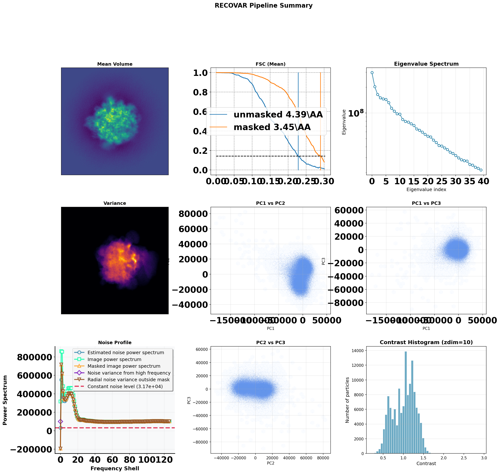
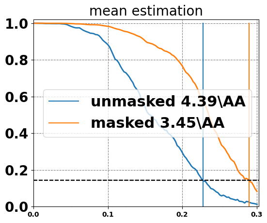
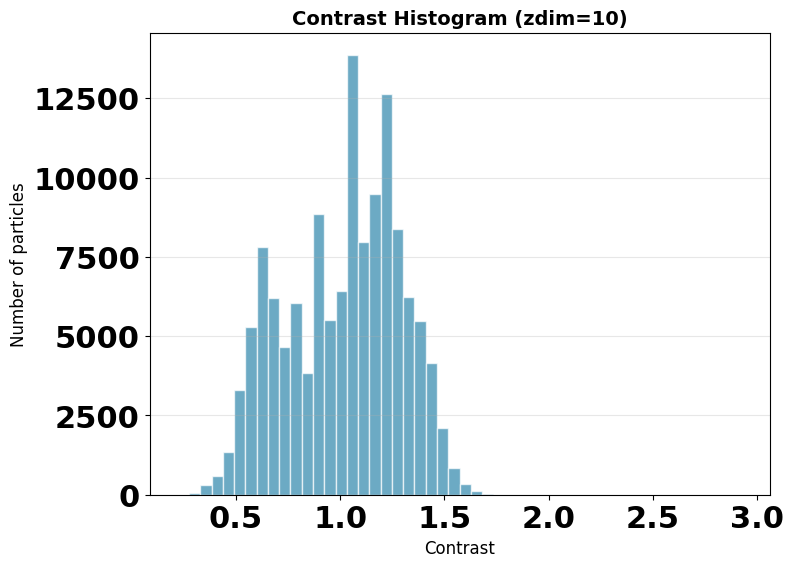
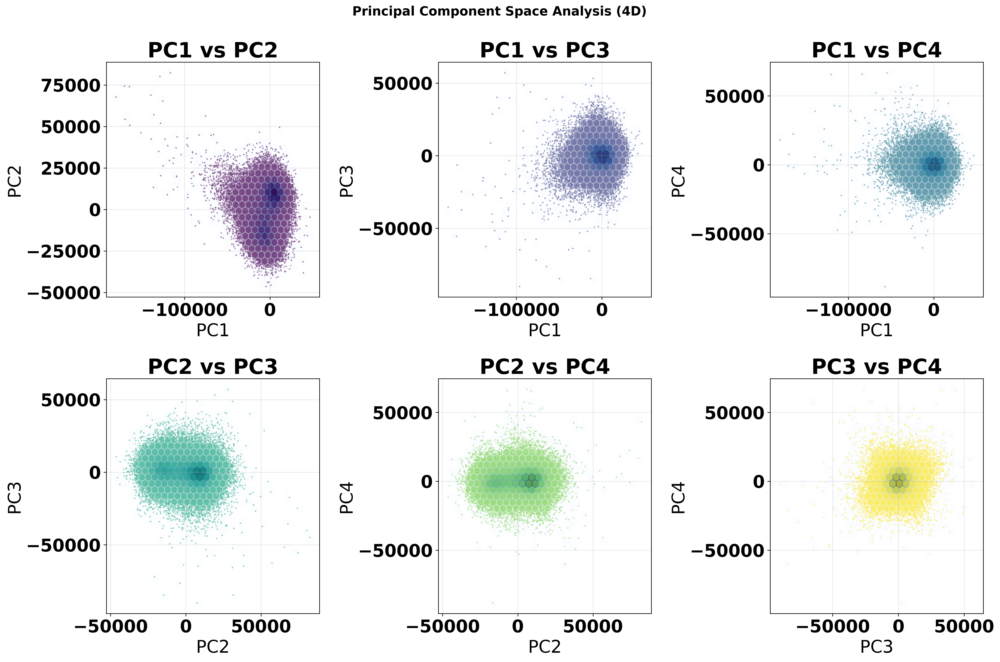
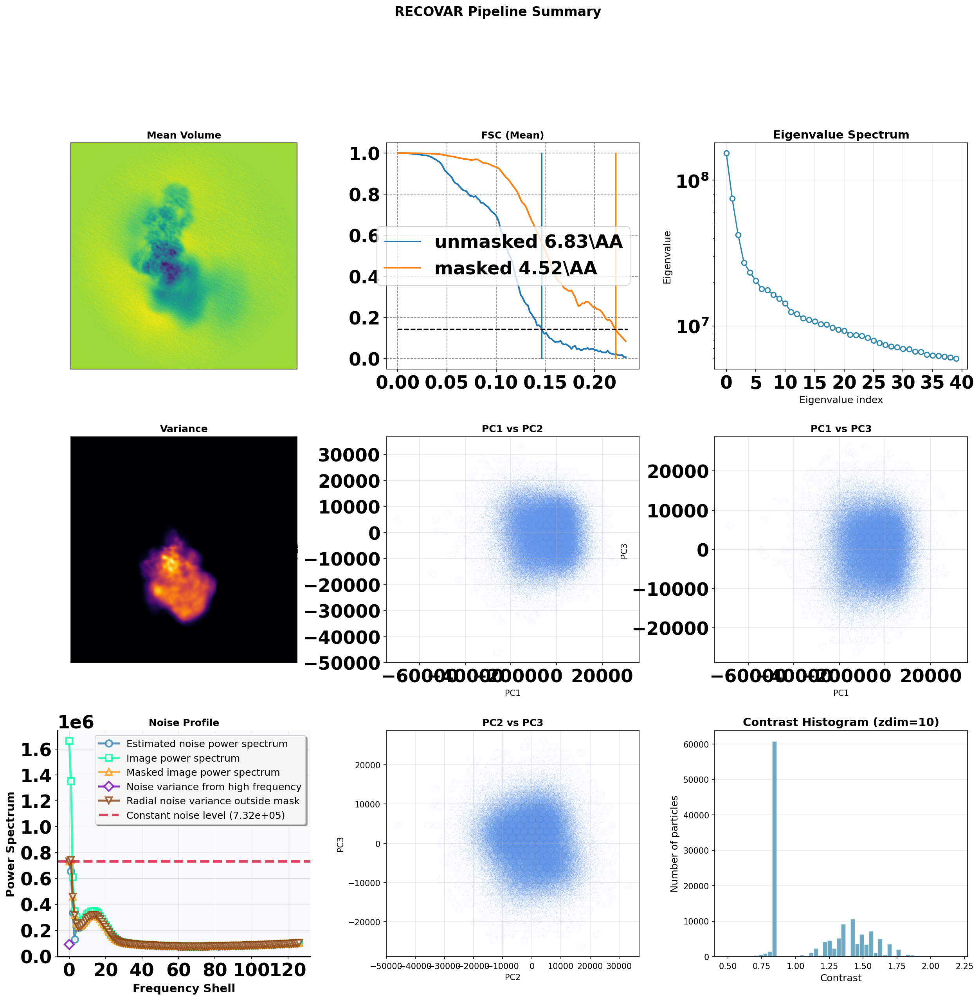
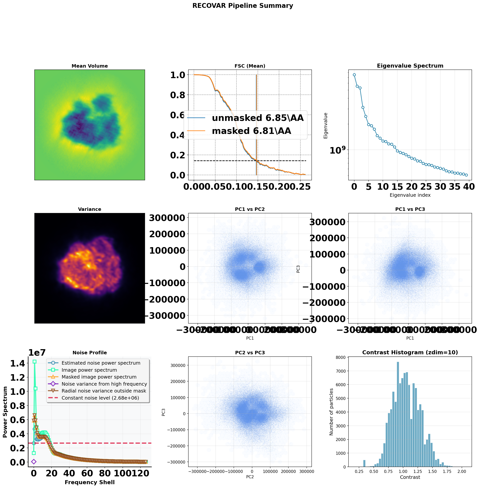
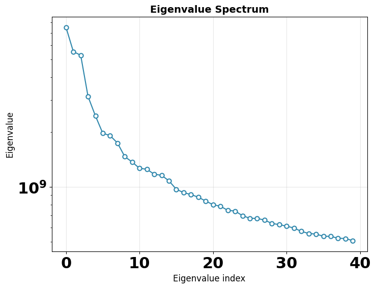
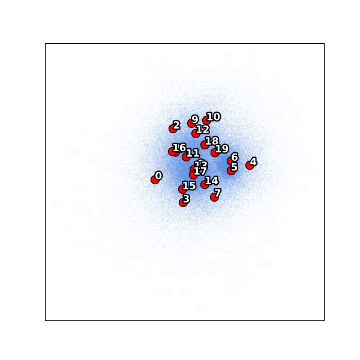
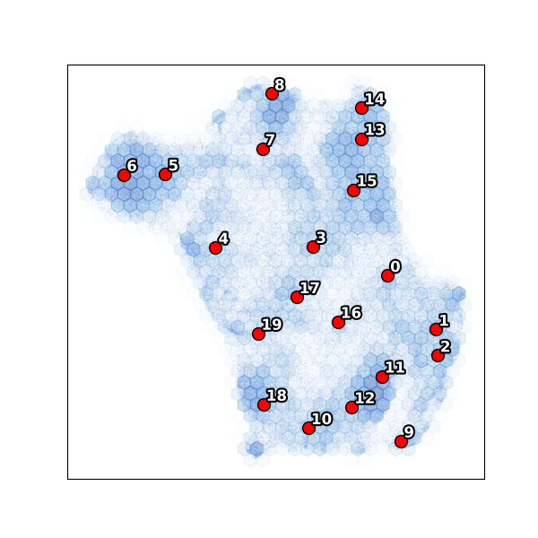

# Tutorial: Worked Example

This tutorial walks through a complete RECOVAR analysis on EMPIAR-10076 (bacterial 50S ribosome, 131,899 particles). Every command is shown with its exact output, and all generated plots are included so you know what to expect.

## Overview

A typical RECOVAR workflow has three steps:

1. **`recovar pipeline`** — compute the mean reconstruction, covariance, principal components (eigenvolumes), and embed each particle into a low-dimensional latent space.
2. **`recovar analyze`** — run k-means clustering on the latent space, generate representative volumes at each cluster center, compute UMAP embeddings, and optionally compute trajectories between states.
3. **Inspect results** — open `.mrc` volumes in ChimeraX, examine latent-space plots, and run follow-up analyses (`compute_state`, `compute_trajectory`, `estimate_conformational_density`).

## Prerequisites

You need:

- A particle stack (`.star`, `.cs`, or `.mrcs`)
- Poses (auto-extracted from `.star`/`.cs`, or a `.pkl` file)
- CTF parameters (auto-extracted from `.star`/`.cs`, or a `.pkl` file)
- A solvent mask (`.mrc` file, or use `sphere` / `from_halfmaps`)
- A GPU (NVIDIA, 12+ GB VRAM recommended)

## Dataset

**EMPIAR-10076**: Bacterial large ribosomal subunit (50S) assembly intermediates.

- **Particles**: 131,899 images, 256 x 256 px
- **Resolution**: ~3 A pixel size
- **Heterogeneity**: Multiple assembly states with varying rRNA/protein occupancy
- **Reference**: Davis et al. (2016) *Structure* 24(4):549-557
- **Runtime**: ~2.5 h pipeline, ~3 h per analyze, ~8.5 h total (A100 GPU)

Input files used:

| File | Description |
|------|-------------|
| `particles.256.mrcs` | Pre-downsampled particle stack |
| `poses.pkl` | Orientation parameters (rotation matrices + translations) |
| `ctf.pkl` | CTF parameters per particle |
| `mask_from_filtered_variance_mean_0802.mrc` | Solvent mask generated from variance map |

## Step 1: Run the pipeline

```bash
recovar pipeline particles.256.mrcs \
    --poses poses.pkl --ctf ctf.pkl \
    --mask mask_from_filtered_variance_mean_0802.mrc \
    --correct-contrast \
    -o output
```

**What each flag does:**

| Flag | Purpose |
|------|---------|
| `particles.256.mrcs` | Input particle stack |
| `--poses poses.pkl` | Pre-extracted orientation parameters |
| `--ctf ctf.pkl` | Pre-extracted CTF parameters |
| `--mask ...` | Solvent mask to improve SNR by excluding solvent regions |
| `--correct-contrast` | Estimate and correct per-particle amplitude scaling |
| `-o output` | Output directory |

!!! tip "Using .star or .cs files"
    If you have a RELION `.star` or cryoSPARC `.cs` file, RECOVAR auto-extracts poses and CTF — no need for `--poses` or `--ctf`:
    ```bash
    recovar pipeline particles.star -o output --mask mask.mrc
    ```

### Pipeline output

The pipeline produces several output directories:

```
output/
├── model/                         # Internal model parameters
│   ├── mean.pkl
│   ├── u.pkl                      # Principal components (eigenvolumes)
│   ├── s.pkl                      # Eigenvalues
│   ├── noise_var.pkl
│   └── ...
└── output/
    ├── volumes/
    │   ├── mean.mrc               # Mean reconstruction
    │   ├── mean_filt.mrc          # Filtered mean
    │   ├── mean_half1_unfil.mrc   # Unfiltered half-map 1
    │   ├── mean_half2_unfil.mrc   # Unfiltered half-map 2
    │   ├── mask.mrc               # Mask used
    │   ├── variance10.mrc         # Variance map (zdim=10)
    │   └── eigen_pos0000.mrc ...  # Eigenvolume slices (positive lobes)
    └── plots/                     # Diagnostic plots (see below)
        ├── pipeline_summary.png
        ├── mean_fsc.png
        ├── eigenvalues.png
        ├── mean_variance_eigenvolume_plots.png
        ├── contrast_histogram.png
        └── principal_component_space_analysis.png
```

### Pipeline plots

The pipeline generates six diagnostic plots. Here is what each one shows and what to look for.

#### Pipeline summary

A consolidated 3x3 overview of all key diagnostics in a single figure.



#### Mean FSC

Fourier Shell Correlation curves for the mean reconstruction, showing both masked and unmasked FSC. The FSC = 0.143 crossing gives the resolution.



**What to look for:** The masked FSC should cross 0.143 at a reasonable resolution for your data. If the FSC drops off much earlier than expected, check your mask or CTF parameters.

#### Eigenvalue spectrum

The eigenvalues represent the variance captured by each principal component. A steep drop-off means most heterogeneity is captured in the first few components.


**What to look for:** A clear gap between signal eigenvalues and the noise floor. The number of eigenvalues above the noise floor suggests the intrinsic dimensionality of your conformational landscape.

#### Mean, variance, and eigenvolumes

A grid showing central slices through the mean volume, the variance map, and the top eigenvolumes (principal components).


**What to look for:**

- The **mean** should look like a reasonable reconstruction
- The **variance** highlights regions of conformational heterogeneity
- **Eigenvolumes** show the spatial patterns of each principal component — they should show structured features, not noise

#### Contrast histogram

Distribution of per-particle amplitude contrast values. This is only generated when `--correct-contrast` is used.



**What to look for:** A roughly unimodal distribution centered near 1.0. Outliers far from 1.0 may indicate bad particles or incorrect CTF.

#### Principal component scatter

Scatter plots of particles in the principal component space (PC1 vs PC2, PC1 vs PC3, PC2 vs PC3).



**What to look for:** Clusters, continuous distributions, or distinct branches in the scatter plots indicate different conformational states or motions.

## Step 2: Analyze results

```bash
recovar analyze output --zdim=10 --n-clusters=20 --n-trajectories=2
```

**What each flag does:**

| Flag | Purpose |
|------|---------|
| `output` | The pipeline output directory |
| `--zdim=10` | Use the 10-dimensional latent space |
| `--n-clusters=20` | Run k-means with 20 clusters |
| `--n-trajectories=2` | Compute 2 trajectories between the most distant cluster pairs |

!!! tip "Choosing zdim"
    Start with `--zdim=10` for a good balance of detail and speed. Use `--zdim=4` for a quick overview or `--zdim=20` for finer resolution. The pipeline computes embeddings for zdim = 1, 2, 4, 10, 20 by default.

### Analyze output

```
output/analysis_10/
├── PCA/
│   ├── PC_01.png                  # PC1 vs PC2 scatter with k-means centers
│   ├── PC_01no_annotate.png       # Same without annotations
│   ├── PC_02.png                  # PC1 vs PC3
│   └── ...
├── umap/
│   ├── kmeans_centers.png         # UMAP with k-means centers labeled
│   ├── kmeans_centers_no_annotate.png
│   ├── sns.png                    # UMAP density (seaborn jointplot)
│   └── sns_hex.png                # UMAP hexbin density
├── kmeans/
│   ├── center000.mrc              # Volume at cluster center 0
│   ├── center001.mrc              # Volume at cluster center 1
│   ├── center000_half1_unfil.mrc  # Unfiltered half-maps for FSC
│   └── ...                        # 20 centers × 3 files each
├── traj000/
│   ├── state000.mrc               # Start of trajectory
│   ├── state001.mrc               # Intermediate state
│   ├── state002.mrc ...           # States along path
│   ├── latent_coords.txt          # Latent coordinates of each state
│   └── density/                   # Local density estimates
├── traj001/                       # Second trajectory
├── kmeans_result.pkl              # K-means cluster assignments
├── trajectory_endpoints.pkl       # Endpoint pairs for trajectories
└── contrast_histogram.png
```

### Analyze plots

#### K-means clustering in PC space

Particle scatter in principal component space with k-means cluster centers annotated by number.


**What to look for:** Cluster centers (numbered) should span the distribution of particles. Closely-spaced clusters in a dense region indicate fine sampling of a conformational landscape; isolated clusters may represent distinct states.

#### UMAP embedding

UMAP reduces the latent space to 2D for visualization. Each point is a particle; colors can represent density, cluster assignment, or other metadata.


**What to look for:** Connected manifolds suggest continuous conformational changes; separated islands suggest discrete states. Compare the UMAP topology with the PC scatter to validate your interpretation.

## Step 3: View volumes

Open the generated `.mrc` volumes in ChimeraX:

```bash
# View all 20 k-means cluster centers as a series
chimerax output/analysis_10/kmeans/center*.mrc

# View a trajectory as a conformational movie
chimerax output/analysis_10/traj000/state*.mrc
```

In ChimeraX, adjust the contour level and use the **Volume Viewer** series playback to flip through conformational states.

## Step 4: Advanced analysis

### Generate volumes at custom coordinates

If you identify interesting regions in the latent space, generate volumes there:

```bash
recovar compute_state output -o my_volumes \
    --latent-points coords.txt --Bfactor=50
```

Where `coords.txt` has one coordinate per line with `zdim` columns.

### Compute high-density trajectories

Find minimum free-energy paths between states:

```bash
# First estimate the conformational density
recovar estimate_conformational_density output --zdim=10

# Then compute a trajectory
recovar compute_trajectory output -o trajectory --zdim=10 \
    --density output/density/deconv_density_knee.pkl \
    --endpts output/analysis_10/kmeans/centers.txt --ind 0,5
```

### Extract particle subsets

Pull out particles belonging to a specific cluster for focused refinement:

```bash
recovar extract_image_subset_from_kmeans output --zdim=10 \
    --cluster-indices 0,1,2 -o subset_particles
```

---

## Second example: EMPIAR-10180

Here is the same workflow on a larger, more complex dataset.

**EMPIAR-10180**: Pre-catalytic spliceosome (327,490 particles, 256 x 256 px). This is a larger dataset with more conformational heterogeneity.

- **Reference**: Plaschka et al. (2017) *Nature* 546:617-621
- **Runtime**: ~2.5 h pipeline, ~3 h per analyze, ~8.5 h total (A100 GPU)

```bash
# Pipeline (note --ind to use a filtered particle subset)
recovar pipeline particles.256.mrcs \
    --poses poses.pkl --ctf ctf.pkl \
    --mask mask_10180.mrc \
    --correct-contrast \
    --ind filtered.ind.pkl \
    -o output

# Analyze
recovar analyze output --zdim=10 --n-clusters=20 --n-trajectories=2
```

### Pipeline summary



### Eigenvalue spectrum


### K-means clustering


### UMAP embedding


---

## Third example: EMPIAR-10028

**EMPIAR-10028**: Plasmodium 80S ribosome (105,247 particles, 256 x 256 px). This example demonstrates two additional features: extracting poses from a cryoSPARC `.cs` file and using a spherical mask when no custom mask is available.

- **Reference**: Wong et al. (2014) *eLife* 3:e03080
- **Runtime**: ~2 h pipeline, ~3 h per analyze, ~8 h total (A100 GPU)

```bash
# Extract poses from cryoSPARC .cs file
python -c "
from recovar.data_io.metadata_parsing import parse_poses_from_cs
import pickle
rots, trans = parse_poses_from_cs('cryosparc_particles.cs', D=256)
pickle.dump((rots, trans), open('poses.pkl', 'wb'))
"

# Pipeline with spherical mask
recovar pipeline particles.256.mrcs \
    --poses poses.pkl --ctf ctf.pkl \
    --mask sphere \
    --correct-contrast \
    -o output

# Analyze
recovar analyze output --zdim=10 --n-clusters=20 --n-trajectories=2
```

### Pipeline summary



### Eigenvalue spectrum



### K-means clustering



### UMAP embedding



---

## Summary of commands

| Step | Command | Output |
|------|---------|--------|
| Run pipeline | `recovar pipeline <particles> -o out --mask mask.mrc` | Mean, covariance, embeddings |
| Analyze | `recovar analyze out --zdim=10` | K-means volumes, UMAP, trajectories |
| Custom volumes | `recovar compute_state out -o vols --latent-points coords.txt` | Volumes at specific coordinates |
| Trajectories | `recovar compute_trajectory out -o traj --zdim=10 --density density.pkl` | Path between states |
| Density | `recovar estimate_conformational_density out --zdim=10` | Conformational density map |
| Extract subset | `recovar extract_image_subset_from_kmeans out --zdim=10` | Particle subset for refinement |

## Tips

!!! tip "Quick setup check"
    Use `--only-mean` for a fast test run that only computes the mean reconstruction:
    ```bash
    recovar pipeline particles.star -o test --mask mask.mrc --only-mean
    ```

!!! tip "Large datasets (>500k particles)"
    Use `--lazy` for lazy loading and `--downsample 128` for speed. Consider `--n-images 100000` for initial exploration.

!!! tip "Interactive setup"
    Use `recovar quickstart` for a guided wizard that builds the pipeline command for you.
