# Tutorial: Worked Examples

This tutorial walks through two complete RECOVAR analyses on paper datasets with real output plots.

- **EMPIAR-10076** (50S ribosome): pipeline, analyze, identify an outlier cluster, extract a clean subset, re-run
- **EMPIAR-10180** (spliceosome): pipeline with filtered particles, analyze, conformational density estimation, trajectory computation

## Overview

A typical RECOVAR workflow:

1. **`recovar pipeline`** — compute the mean reconstruction, covariance, eigenvolumes, and embed particles into a latent space.
2. **`recovar analyze`** — k-means clustering, UMAP embedding, representative volumes, trajectories.
3. **Inspect & iterate** — examine plots, extract particle subsets, estimate conformational density, compute trajectories.

!!! tip "CLI or GUI — your choice"
    This tutorial uses the **command line**, which is reproducible and scriptable. RECOVAR also provides a **web GUI** (`recovar gui`) that lets you do all of this through a browser — launch jobs, explore the latent space interactively, click to generate volumes, and view 3D reconstructions. See the [GUI Guide](gui.md) for details.

## Prerequisites

- A particle stack (`.star`, `.cs`, or `.mrcs`)
- Poses (auto-extracted from `.star`/`.cs`, or a `.pkl` file)
- CTF parameters (auto-extracted from `.star`/`.cs`, or a `.pkl` file)
- A solvent mask (`.mrc` file, or `sphere` / `from_halfmaps`)
- A GPU (NVIDIA, 12+ GB VRAM recommended)

---

## EMPIAR-10076: 50S Ribosomal Subunit

**Dataset**: Bacterial large ribosomal subunit assembly intermediates (131,899 particles, 256 x 256 px).

- **Reference**: Davis et al. (2016) *Structure* 24(4):549-557
- **Heterogeneity**: Multiple assembly states with varying rRNA/protein occupancy

### Step 1: Run the pipeline

```bash
recovar pipeline particles.256.mrcs \
    --poses poses.pkl --ctf ctf.pkl \
    --mask recovar_masks/mask_10076.mrc \
    -o output
```

| Flag | Purpose |
|------|---------|
| `--poses`, `--ctf` | Pre-extracted orientation and CTF parameters |
| `--mask` | Solvent mask to exclude solvent regions |
| `-o output` | Output directory |

!!! tip "Using .star or .cs files"
    RECOVAR auto-extracts poses and CTF from RELION `.star` or cryoSPARC `.cs` files:
    ```bash
    recovar pipeline particles.star -o output --mask mask.mrc
    ```

!!! tip "GUI alternative"
    In the GUI, click **New Job** :material-plus:, select **Pipeline**, browse to your particle file, select a mask, and click **Submit**. The GUI auto-detects the file format and validates inputs before submission. See [GUI: Submitting Jobs](gui.md#submitting-jobs).

#### Key pipeline outputs

**Eigenvalue spectrum** — the variance captured by each principal component. A steep drop-off means most heterogeneity is captured in the first few components. The gap between signal eigenvalues and the noise floor indicates the intrinsic dimensionality of the conformational landscape.

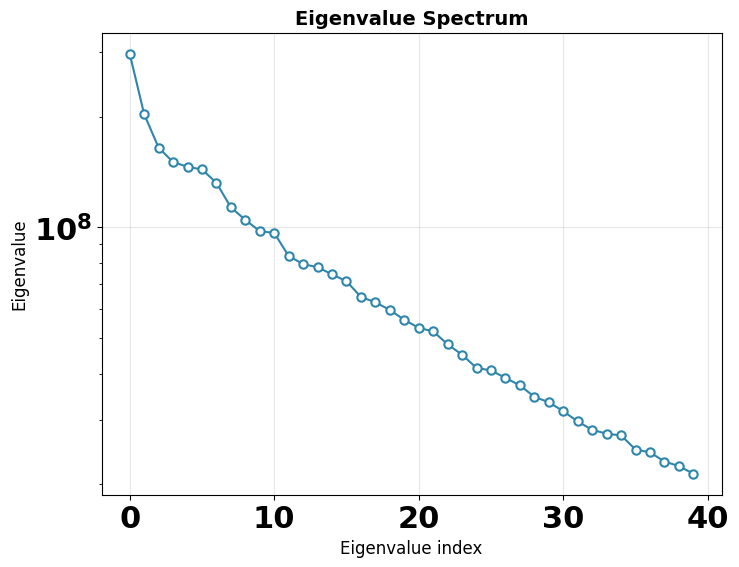

**Mean, variance, and eigenvolumes** — central slices through the mean volume, variance map, and top eigenvolumes. The mean should show a reasonable reconstruction; the variance highlights flexible regions; eigenvolumes should show structured (not noisy) features.

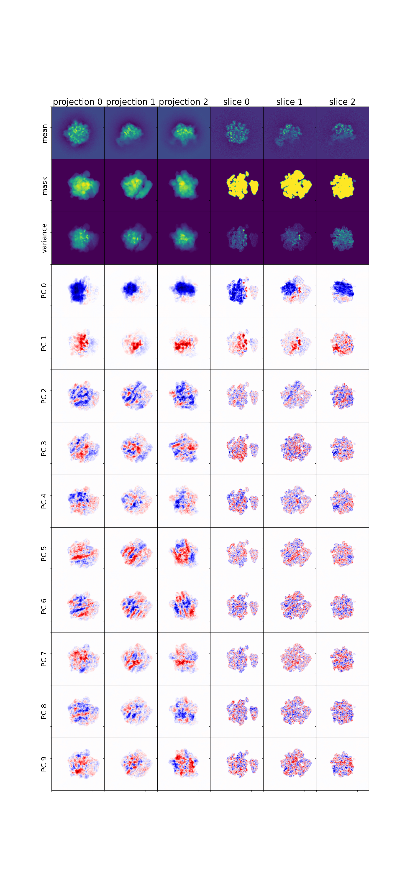

### Step 2: Analyze results

```bash
recovar analyze output --zdim=20 --n-clusters=20 --n-trajectories=2
```

| Flag | Purpose |
|------|---------|
| `--zdim=20` | Use 20-dimensional latent space |
| `--n-clusters=20` | K-means with 20 clusters |
| `--n-trajectories=2` | 2 trajectories between most distant cluster pairs |

#### K-means clustering in PC space

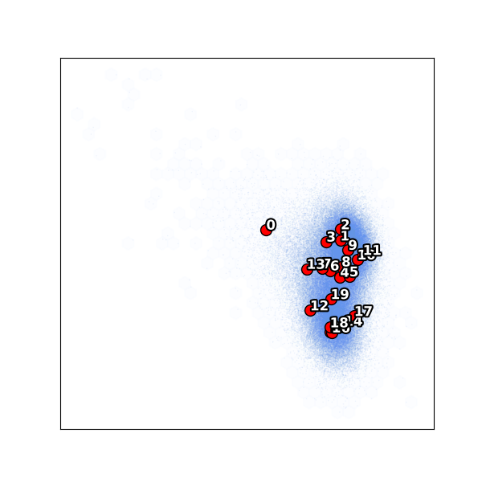

Notice cluster **0** is isolated on the left — far from the main body of particles. This is an outlier population (only 1.3% of particles). The remaining clusters 1–19 span the main conformational landscape.

#### UMAP embedding

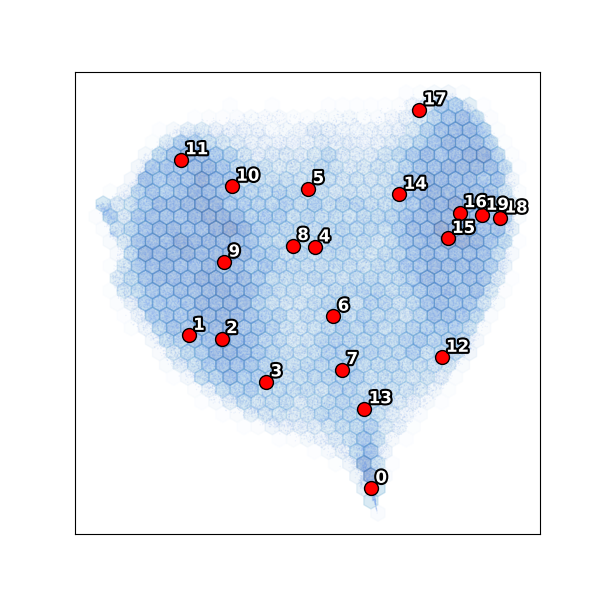

The UMAP confirms the PC scatter: cluster 0 forms a separate island while the main body shows a continuous conformational distribution.

### Step 3: Extract a clean subset

The isolated cluster 0 represents junk or a distinct species. Exclude it and re-run:

```bash
# Exclude cluster 0, keep clusters 1-19
recovar extract_image_subset_from_kmeans \
    output/analysis_20/data/kmeans_result.pkl \
    subset_ind \
    0 -i
```

The indices are written to `subset_ind/indices.pkl`.

### Step 4: Re-run pipeline on the subset

```bash
recovar pipeline particles.256.mrcs \
    --poses poses.pkl --ctf ctf.pkl \
    --mask recovar_masks/mask_10076.mrc \
    --ind subset_ind/indices.pkl \
    -o output_subset
```

The `--ind` flag selects only the particles in `subset_ind.pkl` (~130k of the original 131k).

### Step 5: Re-analyze the cleaned subset

```bash
recovar analyze output_subset --zdim=20 --n-clusters=20 --n-trajectories=2
```

#### Subset: k-means clustering

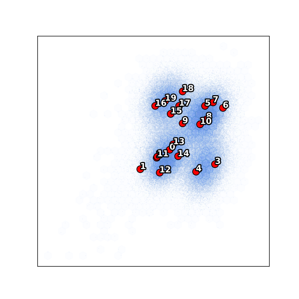

With the outlier removed, all 20 clusters now sample the main conformational landscape more evenly.

#### Subset: UMAP

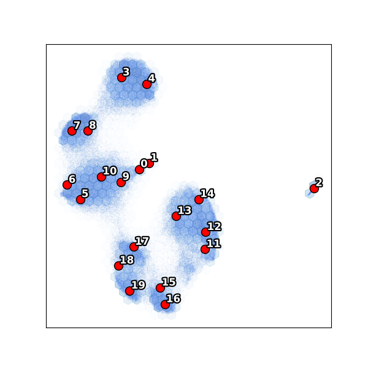

### View volumes

```bash
# View k-means cluster center volumes (1-indexed, zero-padded)
chimerax output_subset/analysis_20/kmeans/center000.mrc center001.mrc ...

# View a trajectory as a conformational movie
chimerax output_subset/analysis_20/traj000/state000.mrc state001.mrc ...
```

!!! tip "Interactive exploration with the GUI"
    Instead of viewing static plots and loading volumes manually, the RECOVAR GUI provides an interactive workflow:

    - **Latent space explorer** — view PCA scatter plots and UMAP embeddings interactively. Click on any point to generate a volume on the fly.
    - **3D volume viewer** — view isosurface renderings directly in the browser with adjustable threshold. Ctrl+click to overlay multiple volumes.
    - **Trajectory builder** — select two points in the scatter plot to compute a trajectory between them and animate the conformational transition.

    See the [GUI Guide](gui.md) for full details.

---

## EMPIAR-10180: Pre-catalytic Spliceosome

**Dataset**: Pre-catalytic spliceosome (327,490 particles, 256 x 256 px), with richer conformational heterogeneity. This example demonstrates the full pipeline including conformational density estimation and trajectory computation.

- **Reference**: Plaschka et al. (2017) *Nature* 546:617-621

### Step 1: Pipeline with filtered particles

```bash
recovar pipeline particles.256.mrcs \
    --poses poses.pkl --ctf ctf.pkl \
    --mask full_mask.mrc \
    --focus-mask focus_mask.mrc \
    --correct-contrast \
    --ind filtered.ind.pkl \
    -o output
```

| Flag | Purpose |
|------|---------|
| `--mask` | Solvent mask covering the entire complex (used for mean reconstruction) |
| `--focus-mask` | Focus mask restricting heterogeneity analysis to a flexible subregion |
| `--correct-contrast` | Correct per-particle amplitude scaling |
| `--ind` | Pre-filtered particle subset (excluding junk from a prior round) |

#### Eigenvalue spectrum

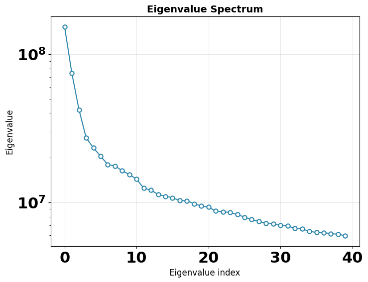

#### Mean, variance, and eigenvolumes

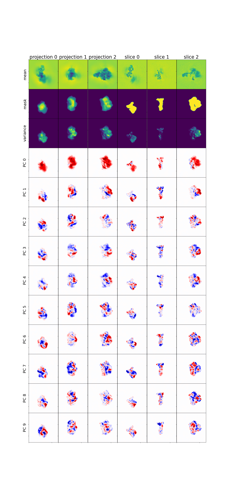

### Step 2: Analyze

```bash
recovar analyze output --zdim=4 --n-clusters=20 --n-trajectories=2
```

#### K-means clustering

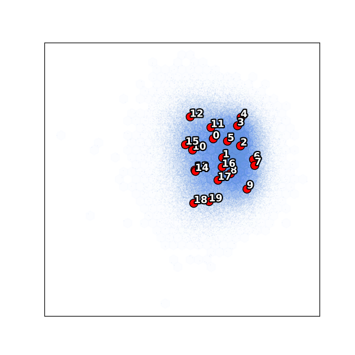

#### UMAP embedding

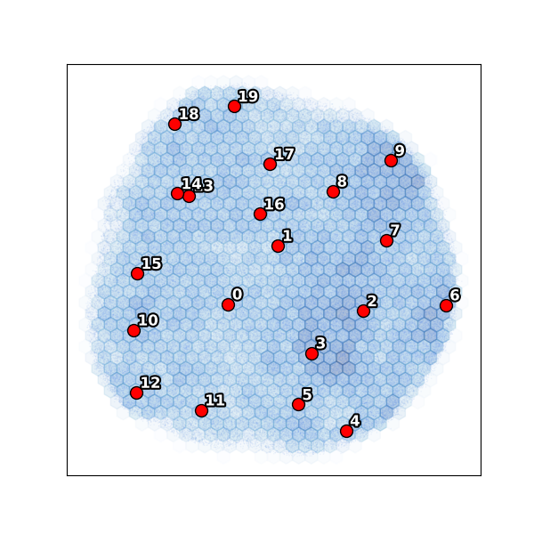

### Step 3: Estimate conformational density

Conformational density estimation maps the free-energy landscape by deconvolving the particle distribution in latent space.

```bash
recovar estimate_conformational_density output \
    --pca_dim=4 --z_dim_used=4
```

| Flag | Purpose |
|------|---------|
| `--pca_dim=4` | Estimate density in 4D PCA subspace |
| `--z_dim_used=4` | Use the 4D latent embedding |

This produces density estimates at different regularization levels in `output/density/`. The `data/deconv_density_knee.pkl` file uses the recommended "knee" regularization.

### Step 4: Compute a trajectory

Using the density landscape, compute a minimum free-energy path between two conformational states:

```bash
recovar compute_trajectory output \
    -o output/trajectory_density \
    --zdim=4 \
    --density output/density/data/deconv_density_knee.pkl \
    --endpts output/analysis_4/kmeans/centers.txt \

    --ind 0,19
```

| Flag | Purpose |
|------|---------|
| `--density` | Deconvolved density for path planning |
| `--endpts` | K-means center coordinates file |
| `--ind 0,19` | Use centers 0 and 19 as trajectory endpoints |

This generates volumes along the minimum free-energy path:

```
output/trajectory_density/
├── state000.mrc ... state005.mrc   # Volumes along the path
├── state000_half1_unfil.mrc ...    # Half-maps for FSC
├── diagnostics/state000/           # Per-volume diagnostics
└── latent_coords.txt               # Latent coordinates of each state
```

View the trajectory in ChimeraX:

```bash
chimerax output/trajectory_density/state*.mrc
```

!!! tip "GUI alternative for trajectories"
    In the GUI's **Latent Space Explorer**, you can select two points directly on the scatter plot to define trajectory endpoints and compute volumes along the path — no need to look up cluster indices or coordinate files. The volumes appear in the 3D viewer automatically.

---

## Using the GUI for analysis

After running `pipeline` and `analyze` (either via CLI or the GUI itself), you can launch the GUI to interactively explore results.

### Running locally (data and browser on the same machine)

If you are running recovar on your own workstation (i.e. both the data and browser are on the same machine), just launch the GUI:

```bash
recovar gui
```

Then open **http://localhost:8080** in your browser.

### Running on a remote cluster (typical case)

More commonly, your data lives on a compute cluster and you want to view the GUI in a browser on your laptop/desktop. This requires two steps:

**Step 1.** Set up an SSH tunnel from your local machine to the cluster. This forwards port 8080 on your laptop to port 8080 on the cluster:

```bash
# Run this on your LOCAL machine (laptop/desktop):
ssh -L 8080:localhost:8080 user@cluster
```

For example, to connect to the Princeton della cluster:

```bash
ssh -L 8080:localhost:8080 mg6942@della.princeton.edu
```

**Step 2.** On the cluster (inside the SSH session), launch the GUI:

```bash
recovar gui
```

Now open **http://localhost:8080** in your local browser — the SSH tunnel makes it appear as if the server is running locally.

!!! tip "Custom port"
    If port 8080 is already in use, pick another port (e.g. 8085) and use it consistently in both the SSH tunnel and the GUI launch: `ssh -L 8085:localhost:8085 ...` and `recovar gui --port 8085`.

### First steps in the GUI

Once the GUI is open, create a project (or open an existing one) and use **Scan for Existing Jobs** to import your pipeline outputs. The dashboard shows all your jobs at a glance:

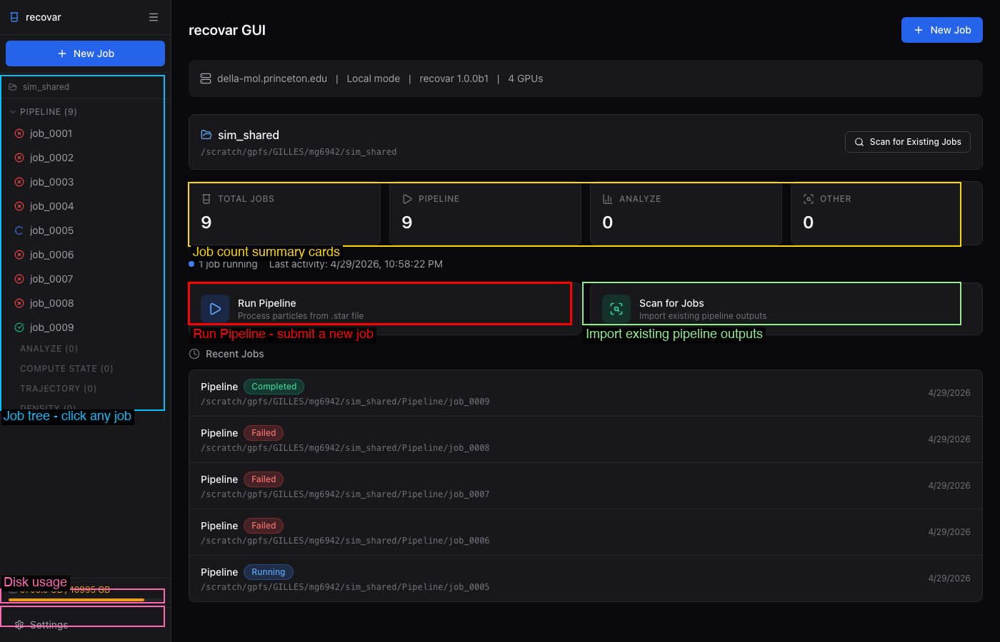

The sidebar lists all jobs organized by type with color-coded status indicators. Click any job to view its details, logs, volumes, and plots.

When a pipeline job completes, the job detail page shows quick preview plots and suggested next steps:

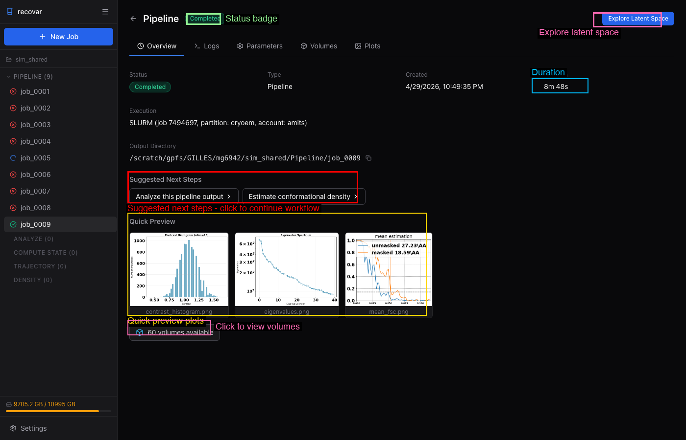

Click **Analyze this pipeline output** to pre-fill an analyze job, or **Explore Latent Space** to open the interactive latent space explorer.

For full GUI documentation, see the [GUI Guide](gui.md).

---

## Output directory reference

### Pipeline output

```
output/
├── job.json                       # Job metadata (version, timing, parameters)
├── command.txt                    # Command that was run
├── run.log                        # Full log
├── README.txt                     # Human-readable output summary
├── model/                         # Internal model
│   ├── params.pkl
│   ├── zdim_4/                    # Per-zdim embeddings
│   │   └── latent_coords.npy
│   └── zdim_10/
│       └── latent_coords.npy
└── output/
    ├── volumes/                   # mean.mrc, half-maps, eigenvolumes, variance maps
    └── plots/                     # Diagnostic plots
```

### Analyze output

```
output/analysis_<zdim>/
├── job.json                       # Job metadata
├── command.txt, run.log, README.txt
├── plots/                         # All visualization outputs
│   ├── contrast_histogram.png
│   ├── PCA/                       # PC scatter plots with k-means centers
│   ├── umap/                      # UMAP embeddings
│   ├── density/                   # Density plots (if density provided)
│   └── density_sliced/            # Sliced density plots
├── data/                          # Non-volume data files
│   ├── kmeans_result.pkl          # K-means labels and centers
│   └── trajectory_endpoints.pkl
├── kmeans/                        # Cluster center volumes
│   ├── center000.mrc, center001.mrc, ...
│   ├── center000_half1_unfil.mrc  # Half-maps
│   ├── centers.txt                # Center coordinates
│   └── diagnostics/center000/     # Per-volume diagnostics
└── traj000/, traj001/             # Trajectory volumes
    ├── state000.mrc, state001.mrc, ...
    └── diagnostics/state000/      # Per-volume diagnostics
```

## Command reference

| Step | Command |
|------|---------|
| Init project | `recovar init_project my_project` |
| Run pipeline | `recovar pipeline <particles> -o out --mask mask.mrc` |
| Analyze | `recovar analyze out --zdim=10 --n-clusters=20` |
| Extract subset | `recovar extract_image_subset_from_kmeans data/kmeans_result.pkl subset_dir 0 -i` |
| Re-run on subset | `recovar pipeline <particles> -o out2 --ind subset_dir/indices.pkl` |
| Density estimation | `recovar estimate_conformational_density out --pca_dim=4` |
| Trajectory | `recovar compute_trajectory out -o traj --density density.pkl --endpts centers.txt` |
| Custom volumes | `recovar compute_state out -o vols --latent-points coords.txt` |
| Project status | `recovar project_status` |
| Launch GUI | `recovar gui` |

## Tips

!!! tip "Quick test"
    Use `--only-mean` for a fast test that only computes the mean reconstruction:
    ```bash
    recovar pipeline particles.star -o test --mask mask.mrc --only-mean
    ```

!!! tip "Large datasets (>500k particles)"
    Use `--lazy` for lazy loading and `--downsample 128` for speed.

!!! tip "Interactive setup"
    Use `recovar gui` for a full web interface to set up and run jobs interactively.
