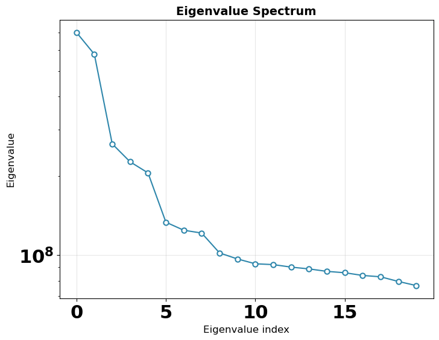
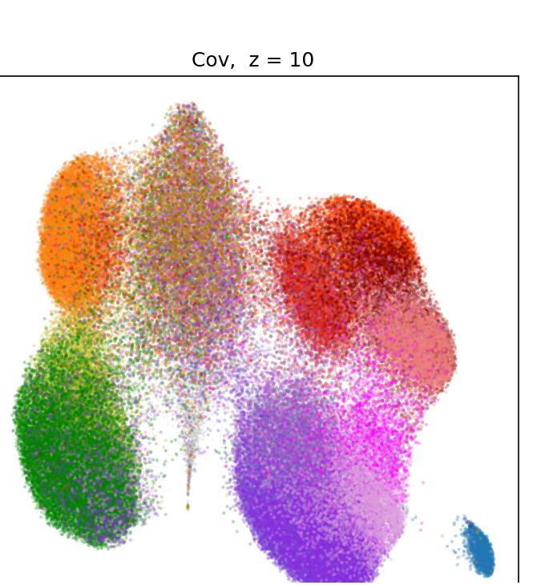
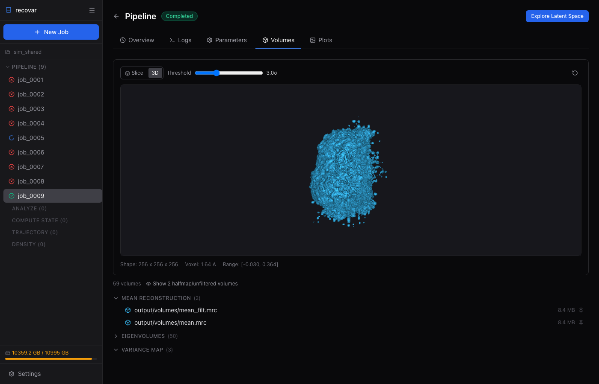

---
hide:
  - navigation
  - toc
---

<!-- Hero section -->
<div class="recovar-hero" markdown>

# RECOVAR

## Tools for cryo-EM heterogeneity analysis

[Get Started](getting-started/quickstart.md){ .md-button .md-button--primary .md-button--lg }
[Web GUI](guide/gui.md){ .md-button }

</div>

---

## Why RECOVAR?

- **Highest resolution** on [CryoBench](https://cryobench.cs.princeton.edu) across multiple datasets
- **Conformational density** and free-energy landscape estimation
- **Cryo-ET support** for tilt-series heterogeneity analysis
- **Web GUI** with interactive latent-space exploration and sub-particle selection
- **Direct input** from RELION (`.star`) and cryoSPARC (`.cs`) -- no format conversion
- **No hallucinations** -- kernel regression produces transparent, verifiable volumes

!!! info "What you need before starting"
    RECOVAR starts **after consensus refinement** in RELION or cryoSPARC. You need:

    1. A particle stack with poses and CTF — a RELION `.star` file or cryoSPARC `.cs` file
    2. A solvent mask (`.mrc`) — or let RECOVAR generate one automatically
    3. An NVIDIA GPU (any Volta or newer — V100, RTX 20/30/40-series, A100, H100)

    RECOVAR outputs: mean reconstruction, variance maps, eigenvolumes, latent coordinates, k-means cluster volumes, UMAP embeddings, and trajectories — all exportable back to RELION/cryoSPARC.

---

## Example output

<div class="example-outputs" markdown>

| Eigenvalue spectrum | UMAP latent space (EMPIAR-10076) |
|:---:|:---:|
|  |  |

</div>

*Inspect results directly in the browser -- 3D volume viewer with adjustable isosurface threshold:*



---

## Typical workflow

The easiest way to use RECOVAR is through the [Web GUI](guide/gui.md) -- launch it with `recovar gui`, then create jobs, explore the latent space, and generate volumes all from your browser.

Or use the command line:

```bash
# 1. Run the pipeline (~10 min for a small dataset)
recovar pipeline particles.star -o output --mask mask.mrc

# 2. Analyze results (k-means, trajectories, UMAP)
recovar analyze output --zdim=10

# 3. Explore interactively in the browser
recovar gui
```

---

## How it works

<div class="pipeline-flow" markdown>

**Particles** :material-arrow-right: **Mean reconstruction** :material-arrow-right: **3D Covariance** :material-arrow-right: **PCA** :material-arrow-right: **Embedding** :material-arrow-right: **Volumes**

</div>

RECOVAR estimates a regularized 3D covariance from your particle images, extracts principal components to build a low-dimensional latent space, and uses kernel regression to generate volumes at any point in that space.

For the full method, see the [paper](https://www.pnas.org/doi/abs/10.1073/pnas.2419140122) or [recorded talk](https://www.youtube.com/watch?v=cQBQlCCRp8Q&t=740s).

---

## Citing RECOVAR

If you use RECOVAR in your research, please cite:

!!! quote "Citation"

    Gilles, M.A. & Singer, A. "Cryo-EM heterogeneity analysis using regularized covariance estimation and kernel regression." *PNAS* (2025). DOI: [10.1073/pnas.2419140122](https://doi.org/10.1073/pnas.2419140122)

    ```bibtex
    @article{gilles2025recovar,
      title={Cryo-EM heterogeneity analysis using regularized covariance estimation and kernel regression},
      author={Gilles, Marc Aur{\`e}le and Singer, Amit},
      journal={Proceedings of the National Academy of Sciences},
      year={2025},
      doi={10.1073/pnas.2419140122}
    }
    ```
