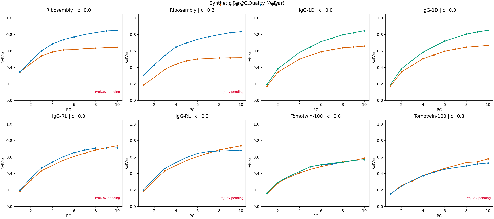
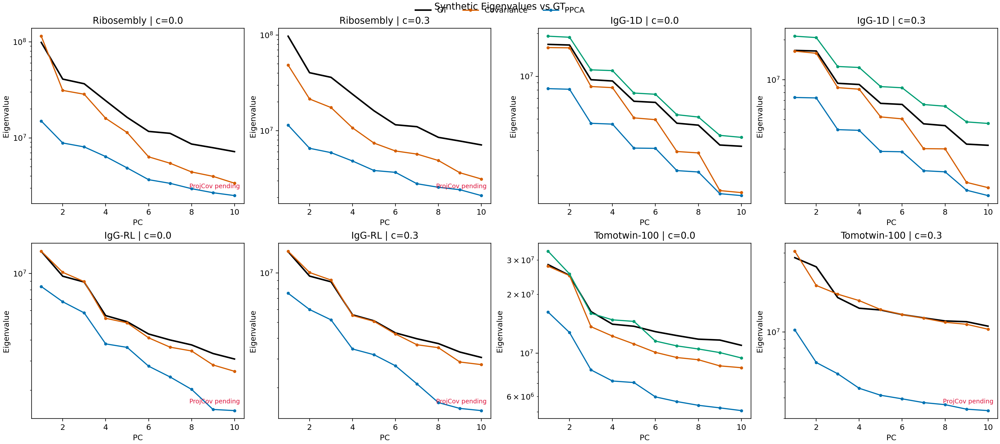
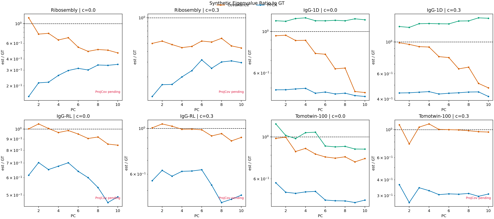
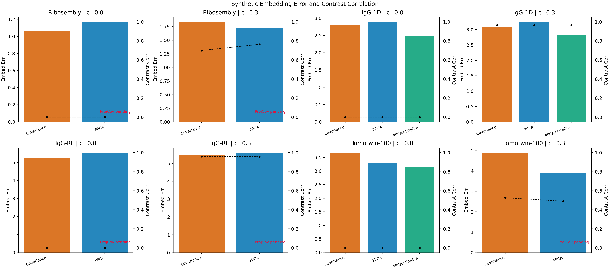

# PPCA Regularization, Spectrum Shrinkage, and Embedding Quality

This note is meant as context for a future agent or human trying to understand
why direct PPCA can recover a good subspace while still producing worse latent
embeddings than expected.

The working empirical theme is:

1. PPCA often gets the **PC directions** mostly right.
2. PPCA can still produce **too-small eigenvalues / latent scales**.
3. When that happens, the **embedding** can be worse even when the basis is
   already good.
4. A post-step that keeps the PPCA span fixed but recomputes the covariance in
   that span (`PPCA -> orthonormalize -> projected covariance`) can improve the
   latent calibration without changing the subspace much.

This note is intentionally open-ended. It is not claiming the mechanism is
fully understood yet.

## Setup

These plots use the synthetic comparison runs already on Della:

- datasets: `Ribosembly`, `IgG-1D`, `IgG-RL`, `Tomotwin-100`
- grid: `128^3`
- images: `100000`
- SNR setting used in the sweep: `noise_level=1.0`
- `zdim=10`
- contrast settings: `c=0.0` and `c=0.3`

Methods compared:

- `Covariance`
- `PPCA`
- `PPCA+ProjCov`
  - run PPCA to get `W`
  - orthonormalize `W -> U`
  - run projected covariance in `span(U)`
  - use the refined `U, S` for the embedding

At the time this note was written, `PPCA+ProjCov` is available for:

- `IgG-1D, c=0.0`
- `IgG-1D, c=0.3`
- `Tomotwin-100, c=0.0`

The other synthetic `PPCA+ProjCov` cases were still limited by orchestration /
memory issues during the original compare runs, so the figures mark those cases
as pending rather than silently dropping them.

## Main Observation

The strongest pattern is not simply "PPCA is better" or "covariance is
better." The pattern is more specific:

- `PPCA` can improve **RelVar** a lot relative to covariance.
- Yet the **eigenvalue spectrum** from `PPCA` can still be too small or too
  flat relative to GT.
- When that happens, **embedding error** can stay worse than the basis quality
  alone would suggest.
- `PPCA+ProjCov` often changes **RelVar very little**, but improves
  **embedding error** noticeably.

That is exactly the signature you would expect if the span is already mostly
correct, but the latent regularization / scale is too aggressive.

## Figures

### 1. Per-PC quality (RelVar)

Read this as: how good are the learned PC directions, one PC at a time?

### 2. Raw eigenvalues against GT

Read this as: do the methods recover the right spectrum magnitude?

### 3. Estimated eigenvalue divided by GT eigenvalue

Read this as: are we overestimating or shrinking the spectrum, and by how
much?

### 4. Embedding error and contrast correlation

Read this as: does the latent representation actually behave better, not just
the basis?

## Minimal Empirical Evidence For "Good Span, Bad Scale"

The cleanest completed cases are:

| Dataset | Contrast | Method | Mean RelVar | Embedding Error |
| --- | --- | --- | ---: | ---: |
| `IgG-1D` | `0.0` | Covariance | `0.5024` | `2.8146` |
| `IgG-1D` | `0.0` | PPCA | `0.6226` | `2.8851` |
| `IgG-1D` | `0.0` | PPCA+ProjCov | `0.6226` | `2.4829` |
| `IgG-1D` | `0.3` | Covariance | `0.5191` | `3.0921` |
| `IgG-1D` | `0.3` | PPCA | `0.6271` | `3.2449` |
| `IgG-1D` | `0.3` | PPCA+ProjCov | `0.6271` | `2.8322` |
| `Tomotwin-100` | `0.0` | Covariance | `0.4340` | `3.6642` |
| `Tomotwin-100` | `0.0` | PPCA | `0.4404` | `3.2968` |
| `Tomotwin-100` | `0.0` | PPCA+ProjCov | `0.4425` | `3.1378` |

The key pattern is:

- `PPCA -> PPCA+ProjCov` changes RelVar only a little.
- But `PPCA -> PPCA+ProjCov` can improve embedding error a lot.

That points to **spectral / latent calibration** being a major issue, not just
subspace identification.

## Working Mathematical Picture

One possible interpretation is:

1. PPCA learns a basis `W` that spans something close to the right subspace.
2. The PPCA regularization and posterior inference shrink the effective latent
   scale too much.
3. This shrinkage shows up as underestimated or distorted `s`, and sometimes
   also in `var(z)` / `var(z_noreg)`.
4. The result is a basis that looks good in RelVar, but latent coordinates
   that are too collapsed for downstream embedding metrics.

Put differently:

- **basis quality** is mostly about the span of `W`
- **embedding quality** is also about how the spectrum `S` and posterior on `z`
  are calibrated

This is why the projected-covariance refinement is interesting:

- it keeps the PPCA span
- it recomputes the covariance in that span
- it often leaves subspace quality almost unchanged
- but it can recover a better latent scale

## Why This Could Happen

These are hypotheses, not settled conclusions.

### Hypothesis A: PPCA regularization is shrinking the latent spectrum too much

This is the most direct reading of the plots.

If the learned eigenvalues are too small, then posterior means of `z` are
pulled too strongly toward zero. That hurts embedding metrics even if the basis
vectors are already close to correct.

### Hypothesis B: the shrinkage is happening in the "wrong" variable

The note in `~/PPCA-EM-Notes/main_look_t_this_one.tex` is relevant only at a
high level: where you place the regularization matters. A penalty in the
gridded / blurred / whitened variable is not the same as a penalty in the final
object or latent variable. If those are conflated, the recovered spectrum can
be biased low even when the span looks reasonable.

That TeX note should not be taken as the answer here, but it is a useful
warning: **the space in which regularization acts matters**.

### Hypothesis C: the basis is right but the saved `s` is not the right
quantity for downstream embedding

Another possibility is that the learned `W` is fine, but the particular
regularized spectrum propagated into the embedding step is too small. In that
case, recalibrating `S` in the fixed PPCA span would naturally help, exactly as
the `PPCA+ProjCov` cases suggest.

## Open Questions

This is the part a follow-up agent should investigate.

1. Where exactly is the dominant shrinkage entering?
   - PPCA M-step?
   - prior on `W` / `S`?
   - latent posterior solve?
   - the contrast-marginalized E-step?
   - the hybrid-shell prior used in current PPCA pipeline runs?

2. Which mismatch matters most for downstream embedding?
   - mismatch between `s` and GT eigenvalues?
   - mismatch between `s` and empirical `var(z)`?
   - mismatch between regularized and unregularized `z`?

3. Is the right fix to change PPCA itself, or to keep PPCA for span discovery
   and recalibrate the spectrum afterward?

4. If regularization is indeed too strong, where should it live instead?
   - on the gridded variable?
   - on the deconvolved basis?
   - on latent coordinates only?
   - with a different whitening / scaling convention?

## What Not To Conclude Too Quickly

- Do **not** conclude that PPCA is failing at subspace recovery. In several
  synthetic cases it clearly is not.
- Do **not** conclude that covariance is always better calibrated. The plots do
  not support that either.
- Do **not** conclude that `PPCA+ProjCov` is the final answer. It is evidence
  that the span/spectrum separation is useful, not proof that the math is
  settled.

## Suggested Next Measurements

If another agent picks this up, the most useful next comparisons are:

1. compare `s`, `var(z)`, and `var(z_noreg)` systematically for all methods
2. check whether posterior shrinkage alone explains the embedding gap
3. test whether replacing only `S` while keeping PPCA `U` is enough
4. isolate exactly where the regularization enters in the PPCA code path
5. compare regularization in the latent variable vs regularization in the
   gridded / reconstructed variable

## Data Sources Used For This Note

Synthetic summaries came from:

- `/scratch/gpfs/GILLES/mg6942/ppca_pipeline_compare_20260402_180524`
- `/scratch/gpfs/GILLES/mg6942/ppca_pipeline_compare_projcov_20260403_1320`
- `/scratch/gpfs/GILLES/mg6942/ppca_pipeline_compare_projcov_retry_gpu20_lowmem_20260403_1605`
- `/scratch/gpfs/GILLES/mg6942/tmp/projcov_refresh_20260403_1735/embedding_contrast_metrics_updated.csv`

## Code References

- direct PPCA / projected-covariance pipeline branch:
  - `recovar/commands/pipeline.py`
- synthetic compare harness:
  - `recovar/ppca/compare_covariance_vs_ppca_pipeline.py`
- synthetic summary writer:
  - `recovar/ppca/summarize_pipeline_compare_sweep.py`
- PPCA implementation:
  - `recovar/ppca/ppca.py`
- existing prior note:
  - `docs/math/ppca_variance_prior_notes.md`
