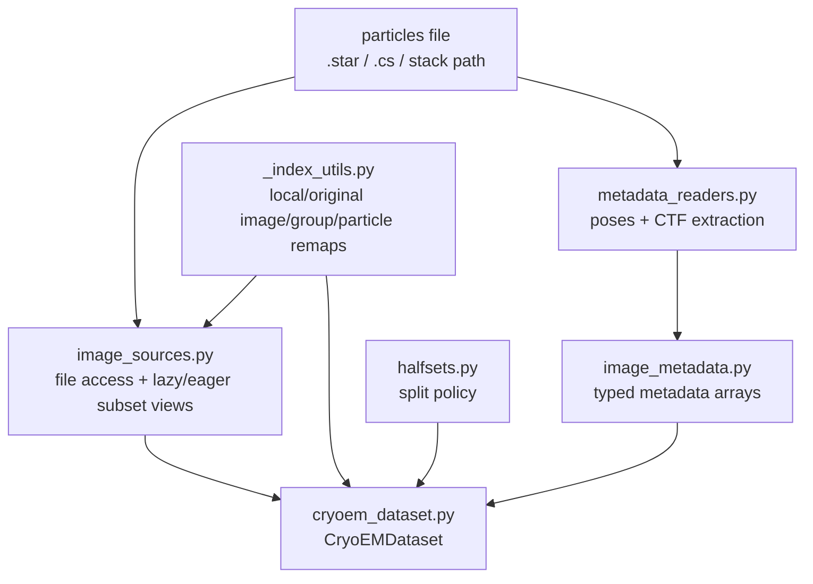

# recovar.data_io

Dataset loading, metadata extraction, and image access for cryo-EM and
cryo-ET data.

## Flow



```text
load_dataset(...)
  -> create_image_source(...)
       -> image_loader.py / image_backends.py backend access
  -> metadata_readers.py
       -> image_metadata.py
  -> CryoEMDataset
       -> iter_batches(...)
       -> subset(...)
       -> halfsets.py for split logic

Cross-cutting indexing
  _index_utils.py
    - DatasetIndexLayout: local <-> original image/group ids
    - TiltSeriesOriginalIndexMap: particle <-> image ids in the original file
```

Keep these responsibilities separate:

- `image_sources.py` owns raw image access, lazy/eager loading, and subset views.
- `image_metadata.py` owns rotations, translations, and CTF rows.
- `cryoem_dataset.py` is the only high-level coordinator and batch iterator surface.
- `halfsets.py` owns split policy and halfset bookkeeping.
- `_index_utils.py` owns image/group/particle remapping logic.
- `image_backends.py` owns the low-level stack and tilt-series loaders used underneath image sources.

## cryoem_dataset

Core dataset classes and loading functions.

::: recovar.data_io.cryoem_dataset
    options:
      members_order: source

## image_backends

Low-level Grain-backed image backends.

::: recovar.data_io.image_backends
    options:
      members_order: source

## image_sources

Raw image loading abstraction and subset/image-group remapping.

::: recovar.data_io.image_sources
    options:
      members_order: source

## image_metadata

Typed metadata container for poses and CTF rows.

::: recovar.data_io.image_metadata
    options:
      members_order: source

## halfsets

Halfset and split logic for SPA and cryo-ET.

::: recovar.data_io.halfsets
    options:
      members_order: source

## _index_utils

Canonical local/original image, group, and particle index mapping helpers.

::: recovar.data_io._index_utils
    options:
      members_order: source

## metadata_readers

Extract poses and CTF parameters from RELION `.star` and cryoSPARC `.cs` files.

::: recovar.data_io.metadata_readers
    options:
      members_order: source

## starfile

RELION `.star` file reading and writing.

::: recovar.data_io.starfile
    options:
      members_order: source

## load_utils

CTF and pose loading utilities (legacy pickle format).

::: recovar.data_io.load_utils
    options:
      members_order: source

## image_loader

Image loading from MRC/MRCS stacks and HDF5 files.

::: recovar.data_io.image_loader
    options:
      members_order: source
